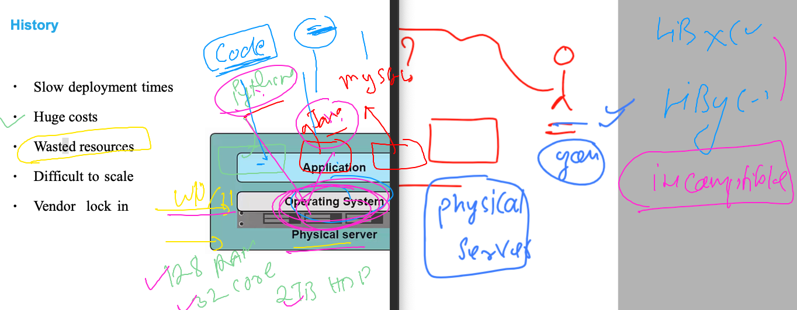
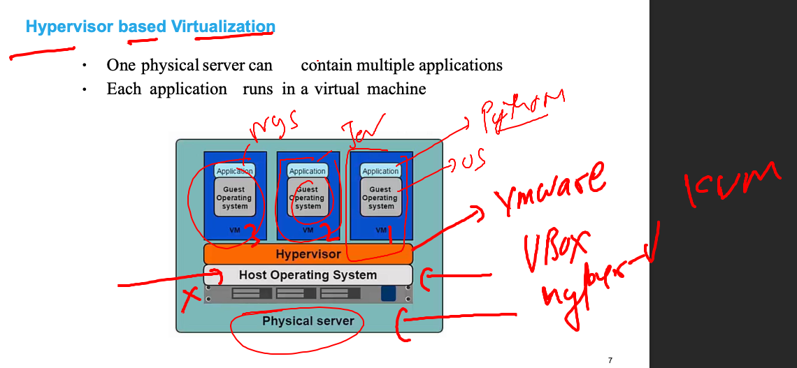
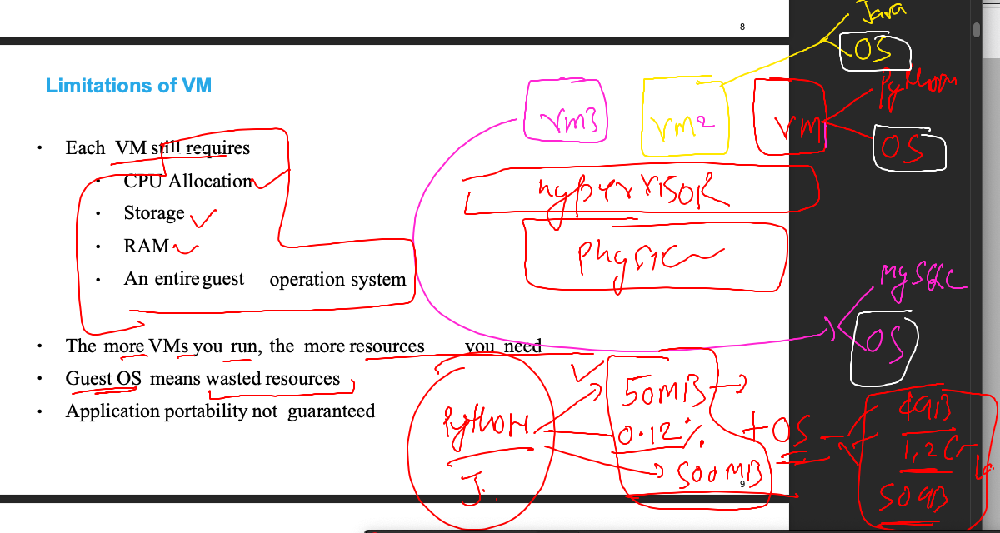
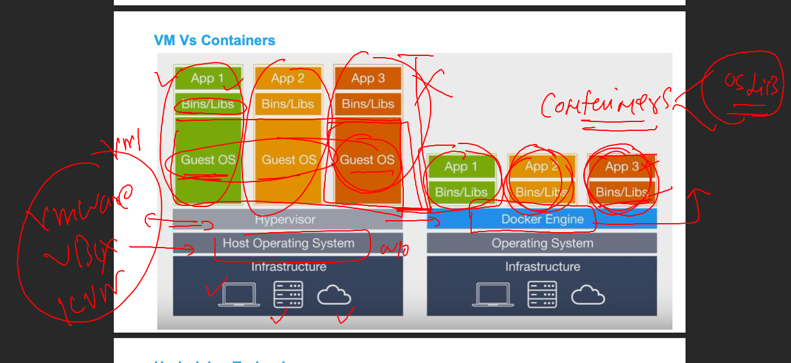
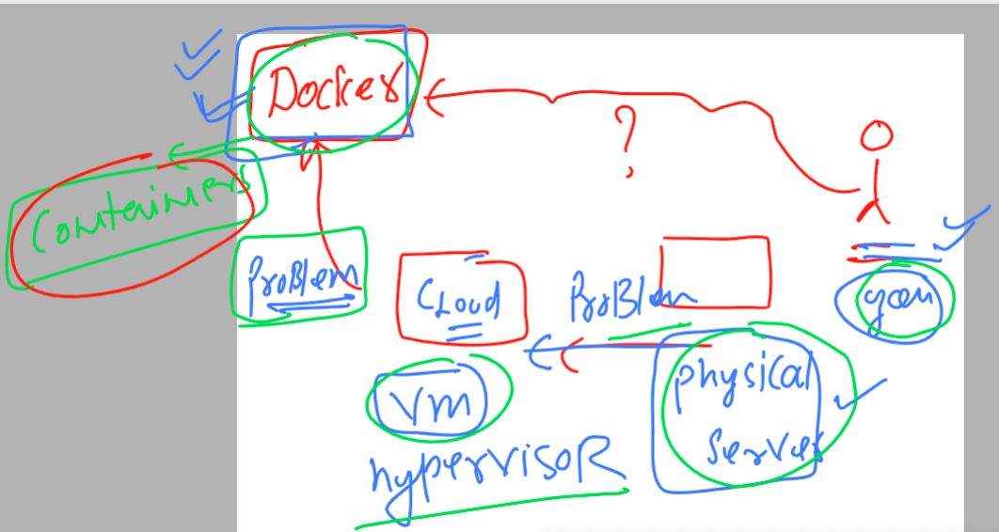

# k8s-cloud4c-b2

### problem with physical server in code run & testing 


### Problem with multiple platform with same OS 



### solution using Hypervisor based virtualization 



### creating a new vm means wasting resources 



### Introduction to containers using docker 



### reaching docker from history 



## docker Installation 

### Linux server to install docker 

```
[root@docker ~]# yum  install docker 
Failed to set locale, defaulting to C
Loaded plugins: extras_suggestions, langpacks, priorities, update-motd
amzn2-core                                                                                         | 3.7 kB  00:00:00     
Resolving Dependencies
--> Running transaction check
---> Package docker.x86_64 0:20.10.23-1.amzn2.0.1 will be installed
--> Processing Dependency: runc >= 1.0.0 for package: docker-20.10.23-1.amzn2.0.1.x86_64
--> Processing Dependenc
```

### starting docker service 

```
[root@docker ~]# systemctl start  docker 
[root@docker ~]# systemctl enable  docker 
Created symlink from /etc/systemd/system/multi-user.target.wants/docker.service to /usr/lib/systemd/system/docker.service.
[root@docker ~]# systemctl status  docker 
● docker.service - Docker Application Container Engine
   Loaded: loaded (/usr/lib/systemd/system/docker.service; enabled; vendor preset: disabled)
   Active: active (running) since Mon 2023-05-22 12:41:39 UTC; 12s ago
     Docs: https://docs.docker.com
 Main PID: 30180 (dockerd)
   CGroup: /system.slice/docker.service
           └─30180 /usr/bin/dockerd -H fd:// --containerd=/run/containerd/containerd.sock --default-ulimit nofile=32768...


```

### login to remote linux server and checking docker installation 

```
fire@ashutoshhs-MacBook-Air ~ % ssh   john@3.230.252.135  
The authenticity of host '3.230.252.135 (3.230.252.135)' can't be established.
ECDSA key fingerprint is SHA256:nd+n5WNMKKq+kmmi+YMsq30Hu0MCVVvnbWOWCF8Oxkw.
Are you sure you want to continue connecting (yes/no/[fingerprint])? yes
Warning: Permanently added '3.230.252.135' (ECDSA) to the list of known hosts.
john@3.230.252.135's password: 

       __|  __|_  )
       _|  (     /   Amazon Linux 2 AMI
      ___|\___|___|

https://aws.amazon.com/amazon-linux-2/
4 package(s) needed for security, out of 14 available
Run "sudo yum update" to apply all updates.
-bash: warning: setlocale: LC_CTYPE: cannot change locale (UTF-8): No such file or directory
[john@docker ~]$ 
[john@docker ~]$ 
[john@docker ~]$ whoami
john
[john@docker ~]$ docker  version 
Client:
 Version:           20.10.23
 API version:       1.41
 Go version:        go1.18.9
 Git commit:        7155243
 Built:             Tue Apr 11 22:56:36 2023
 OS/Arch:           linux/amd64
 Context:           default
 Experimental:      true

Server:
 Engine:
  Version:          20.10.23
  API version:      1.41 (minimum version 1.12)
  Go version:       go1.18.9
  Git commit:       6051f14
  Built:            Tue Apr 11 22:57:17 2023
  OS/Arch:          linux/amd64
  Experimental:     false
 containerd:
  Version:          1.6.19
  GitCommit:        1e1ea6e986c6c86565bc
```


