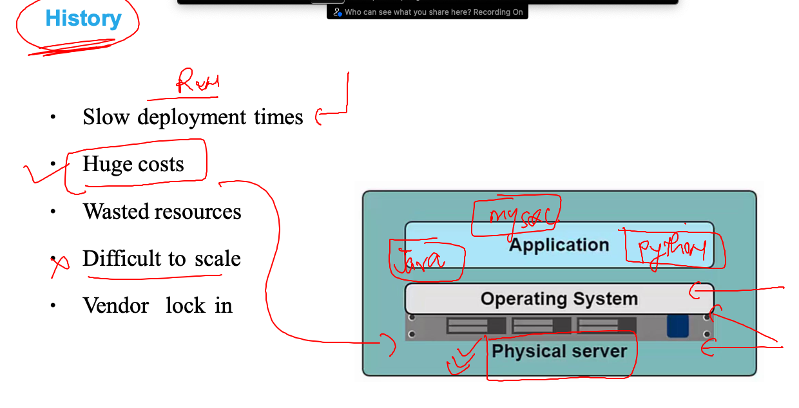

# k8s-cloud4c-b2

### problem with physical server in code run & testing 

### Problem with multiple platform with same OS 

### solution using Hypervisor based virtualization 

### creating a new vm means wasting resources 

### Introduction to containers using docker 

### reaching docker from history 

