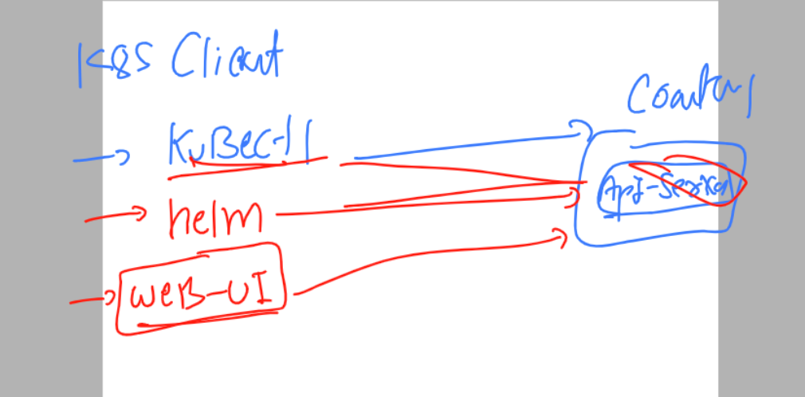
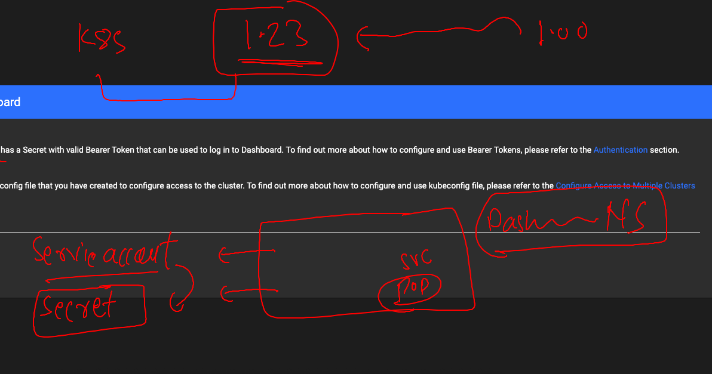

# k8s-cloud4c-b2

### Revision of Docker 


### Internal k8s components are running as POd 


### listing all the components in kube-system namespace 

```
[ec2-user@docker ashu-docker-images]$ kubectl    -n  kube-system      get  pods
NAME                                                    READY   STATUS    RESTARTS      AGE
calico-kube-controllers-57b57c56f-5thxm                 1/1     Running   7 (32m ago)   15d
calico-node-2wpr5                                       1/1     Running   7 (32m ago)   15d
calico-node-g64g7                                       1/1     Running   7 (32m ago)   15d
calico-node-hqsd7                                       1/1     Running   7 (32m ago)   15d
calico-node-jsrtw                                       1/1     Running   7 (32m ago)   15d
calico-node-x9mtk                                       1/1     Running   7 (32m ago)   15d
coredns-787d4945fb-5qkbg                                1/1     Running   7 (32m ago)   15d
coredns-787d4945fb-86274                                1/1     Running   7 (32m ago)   15d
etcd-ip-172-31-23-211.ec2.internal                      1/1     Running   7 (32m ago)   15d
kube-apiserver-ip-172-31-23-211.ec2.internal            1/1     Running   7 (32m ago)   15d
kube-controller-manager-ip-172-31-23-211.ec2.internal   1/1     Running   7 (32m ago)   15d
kube-proxy-ncx2c                                        1/1     Running   7 (32m ago)   15d
kube-proxy-qws8n                                        1/1     Running   7 (32m ago)   15d
kube-proxy-wjnxp                                        1/1     Running   7 (32m ago)   15d
kube-proxy-x6cfw                                        1/1     Running   7 (32m ago)   15d
kube-proxy-xc427                                        1/1     Running   7 (32m ago)   15d
kube-scheduler-ip-172-31-23-211.ec2.internal            1/1     Running   7 (32m ago)   15d

```
### k8s client options 



### link to deploy dashboard in k8s 

[click_here](https://kubernetes.io/docs/tasks/access-application-cluster/web-ui-dashboard/)

### Deploy k8s official dashboard 

```
[ec2-user@docker ashu-docker-images]$ kubectl apply -f https://raw.githubusercontent.com/kubernetes/dashboard/v2.7.0/aio/deploy/recommended.yaml
namespace/kubernetes-dashboard created
serviceaccount/kubernetes-dashboard created
service/kubernetes-dashboard created
secret/kubernetes-dashboard-certs created
secret/kubernetes-dashboard-csrf created
secret/kubernetes-dashboard-key-holder created
configmap/kubernetes-dashboard-settings created
role.rbac.authorization.k8s.io/kubernetes-dashboard created
clusterrole.rbac.authorization.k8s.io/ku
```

### lets verify 

```
[ec2-user@docker ashu-docker-images]$ kubectl  -n kubernetes-dashboard    get  deploy 
NAME                        READY   UP-TO-DATE   AVAILABLE   AGE
dashboard-metrics-scraper   1/1     1            1           69s
kubernetes-dashboard        1/1     1            1           69s
[ec2-user@docker ashu-docker-images]$ kubectl  -n kubernetes-dashboard    get  po 
NAME                                        READY   STATUS    RESTARTS   AGE
dashboard-metrics-scraper-7bc864c59-fz64w   1/1     Running   0          87s
kubernetes-dashboard-6c7ccbcf87-tkxd6       1/1     Running   0          87s
[ec2-user@docker ashu-docker-images]$ kubectl  -n kubernetes-dashboard    get  svc
NAME                        TYPE        CLUSTER-IP      EXTERNAL-IP   PORT(S)    AGE
dashboard-metrics-scraper   ClusterIP   10.105.5.66     <none>        8000/TCP   91s
kubernetes-dashboard        ClusterIP   10.111.127.22   <none>        443/TCP    91s
```

### changing service type from Cluster IP to Nodeport

```
[ec2-user@docker ashu-docker-images]$ kubectl  -n kubernetes-dashboard    get  svc
NAME                        TYPE        CLUSTER-IP      EXTERNAL-IP   PORT(S)    AGE
dashboard-metrics-scraper   ClusterIP   10.105.5.66     <none>        8000/TCP   3m10s
kubernetes-dashboard        ClusterIP   10.111.127.22   <none>        443/TCP    3m10s
[ec2-user@docker ashu-docker-images]$ 
[ec2-user@docker ashu-docker-images]$ 
[ec2-user@docker ashu-docker-images]$ 
[ec2-user@docker ashu-docker-images]$ kubectl  -n kubernetes-dashboard    edit  svc  kubernetes-dashboard  
service/kubernetes-dashboard edited
[ec2-user@docker ashu-docker-images]$ kubectl  -n kubernetes-dashboard    get  svc
NAME                        TYPE        CLUSTER-IP      EXTERNAL-IP   PORT(S)         AGE
dashboard-metrics-scraper   ClusterIP   10.105.5.66     <none>        8000/TCP        6m38s
kubernetes-dashboard        NodePort    10.111.127.22   <none>        443:32560/TCP   6m38s
[ec2-user@docker ashu-docker-images]$ 

```

### understanding token storage in dashboard 



### creating svc account token in dashboard 

```
[ec2-user@docker ashu-docker-images]$ kubectl  -n kubernetes-dashboard   get  serviceaccount 
NAME                   SECRETS   AGE
default                0         15m
kubernetes-dashboard   0         15m
[ec2-user@docker ashu-docker-images]$ kubectl  -n    kubernetes-dashboard  create token  kubernetes-dashboard
eyJhbGciOiJSUzI1NiIsImtpZCI6IkxjOGpjdllXbnFzcnNONW5ZcVA0a21QQkxYODBVN3h5Sy1uTmVPaE9zQkkifQ.eyJhdWQiOlsiaHR0cHM6Ly9rdWJlcm5ldGVzLmRlZmF1bHQuc3ZjLmNsdXN0ZXIubG9jYWwiXSwiZXhwIjoxNjg1OTcxMzM1LCJpYXQiOjE2ODU5Njc3MzUsImlzcyI6Imh0dHBzOi8va3ViZXJuZXRlcy5kZWZhdWx0LnN2Yy5jbHVzdGVyLmxvY2FsIiwia3ViZXJuZXRlcy5pbyI6eyJuYW1lc3BhY2UiOiJrdWJlcm5ldGVzLWRhc2hib2FyZCIsInNlcnZpY2VhY2NvdW50Ijp7Im5hbWUiOiJrdWJlcm5ldGVzLWRhc2hib2FyZCIsInVpZCI6Ijc1OTI1YTZhLWI4YTktNGJ
```

### giving admin power to dashboard 

```
[ec2-user@docker ashu-docker-images]$ kubectl create clusterrolebinding power --clusterrole cluster-admin --serviceaccount kubernetes-dashboard:kubernetes-dashboard
clusterrolebinding.rbac.authorization.k8s.io/power created
```


