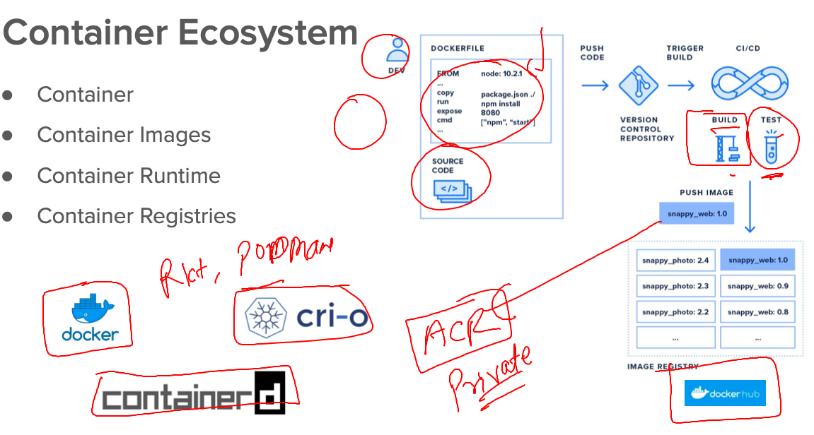
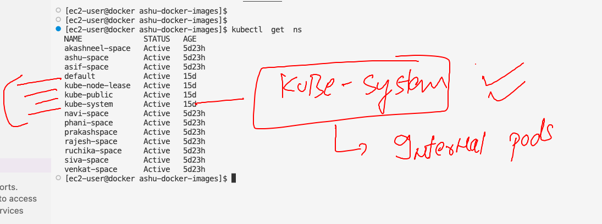

# k8s-cloud4c-b2

### Revision of Docker 



### Internal k8s components are running as POd 



### listing all the components in kube-system namespace 

```
[ec2-user@docker ashu-docker-images]$ kubectl    -n  kube-system      get  pods
NAME                                                    READY   STATUS    RESTARTS      AGE
calico-kube-controllers-57b57c56f-5thxm                 1/1     Running   7 (32m ago)   15d
calico-node-2wpr5                                       1/1     Running   7 (32m ago)   15d
calico-node-g64g7                                       1/1     Running   7 (32m ago)   15d
calico-node-hqsd7                                       1/1     Running   7 (32m ago)   15d
calico-node-jsrtw                                       1/1     Running   7 (32m ago)   15d
calico-node-x9mtk                                       1/1     Running   7 (32m ago)   15d
coredns-787d4945fb-5qkbg                                1/1     Running   7 (32m ago)   15d
coredns-787d4945fb-86274                                1/1     Running   7 (32m ago)   15d
etcd-ip-172-31-23-211.ec2.internal                      1/1     Running   7 (32m ago)   15d
kube-apiserver-ip-172-31-23-211.ec2.internal            1/1     Running   7 (32m ago)   15d
kube-controller-manager-ip-172-31-23-211.ec2.internal   1/1     Running   7 (32m ago)   15d
kube-proxy-ncx2c                                        1/1     Running   7 (32m ago)   15d
kube-proxy-qws8n                                        1/1     Running   7 (32m ago)   15d
kube-proxy-wjnxp                                        1/1     Running   7 (32m ago)   15d
kube-proxy-x6cfw                                        1/1     Running   7 (32m ago)   15d
kube-proxy-xc427                                        1/1     Running   7 (32m ago)   15d
kube-scheduler-ip-172-31-23-211.ec2.internal            1/1     Running   7 (32m ago)   15d

```

