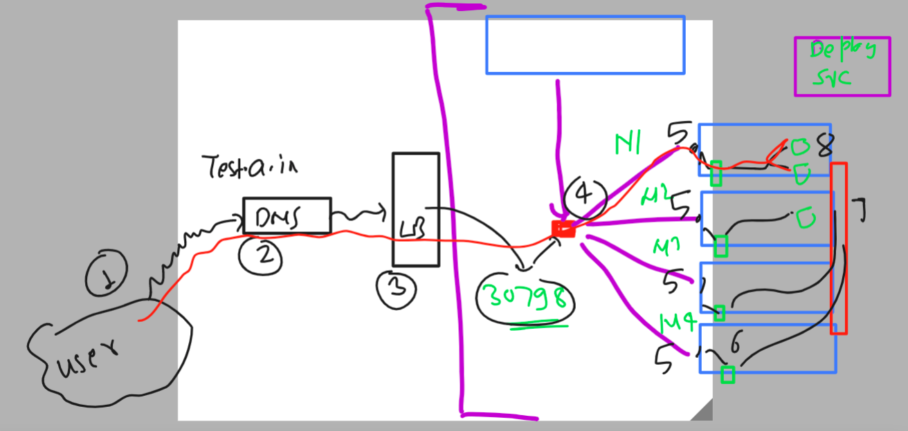
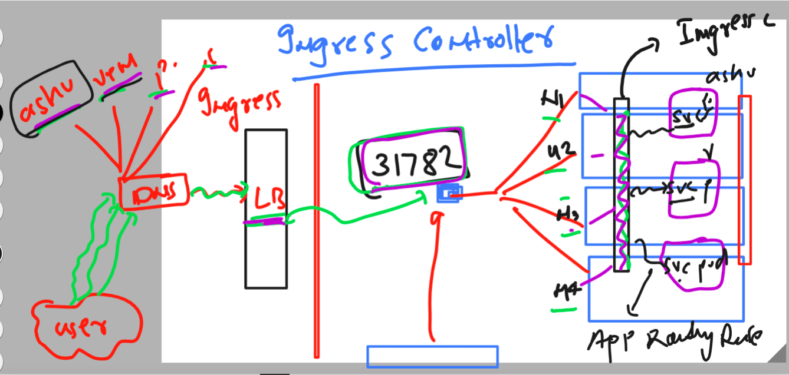
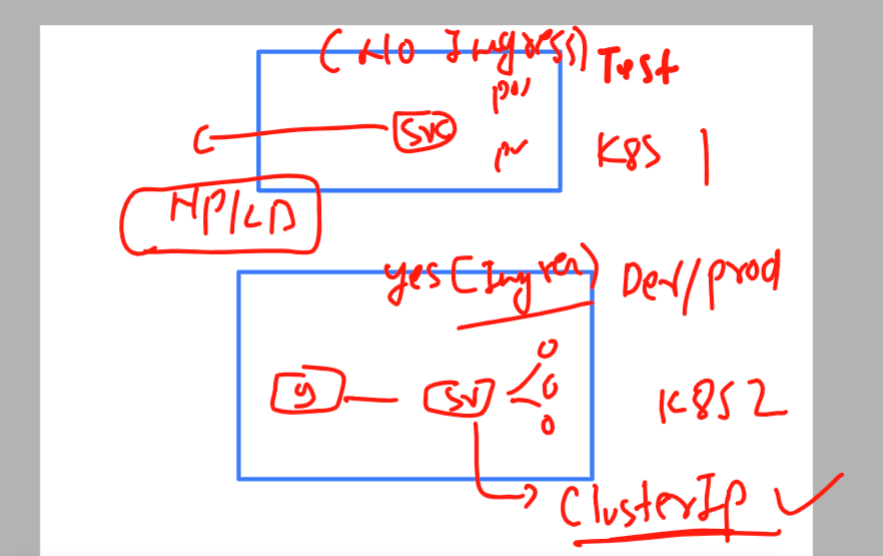

# k8s-cloud4c-b2

## REvision for accessing and deploy app in k8s with External DNS and LB 



### Introduction to the working of Ingress controller 



### using service with Ingress controller or without ingress controller 



### cleaning up namespace data 

```
[ec2-user@docker ashu-docker-images]$ kubectl  config get-contexts 
CURRENT   NAME                          CLUSTER      AUTHINFO           NAMESPACE
*         kubernetes-admin@kubernetes   kubernetes   kubernetes-admin   ashu-space
[ec2-user@docker ashu-docker-images]$ 
[ec2-user@docker ashu-docker-images]$ kubectl get all
NAME                             READY   STATUS    RESTARTS      AGE
pod/ashu-deploy-d4dc9fd9-2vjfp   1/1     Running   1 (56m ago)   22h
pod/ashu-deploy-d4dc9fd9-7lbk9   1/1     Running   1 (56m ago)   22h
pod/ashu-deploy-d4dc9fd9-vghxz   1/1     Running   1 (56m ago)   22h

NAME               TYPE           CLUSTER-IP       EXTERNAL-IP   PORT(S)        AGE
service/ashu-app   LoadBalancer   10.102.134.7     <pending>     80:31481/TCP   23h
service/lb008      NodePort       10.100.228.216   <none>        80:30037/TCP   22h

NAME                          READY   UP-TO-DATE   AVAILABLE   AGE
deployment.apps/ashu-deploy   3/3     3            3           22h

NAME                                   DESIRED   CURRENT   READY   AGE
replicaset.apps/ashu-deploy-d4dc9fd9   3         3         3       22h
[ec2-user@docker ashu-docker-images]$ kubectl  delete all --all
pod "ashu-deploy-d4dc9fd9-2vjfp" deleted
pod "ashu-deploy-d4dc9fd9-7lbk9" deleted
pod "ashu-deploy-d4dc9fd9-vghxz" deleted
service "ashu-app" deleted
service "lb008" deleted
deployment.apps "ashu-deploy" deleted
```

## Demo of app deployment with Ingress 

### web app deployment 
```
[ec2-user@docker ashu-docker-images]$ ls
ashu-k8s-appdeploy  html-sample-app  java-code  python-code  webapps
[ec2-user@docker ashu-docker-images]$ cd ashu-k8s-appdeploy/
[ec2-user@docker ashu-k8s-appdeploy]$ ls
ashu-pod1.yaml   ashu-webapp-rc.yaml  azureimagepod.yaml  day7pod.yaml      mypod.yaml      nodeport.yaml  svcbyrc.yaml
ashupodnew.json  autopod.yaml         day7nodeport.yaml   deployment1.yaml  nodeport4.yaml  secret.yaml    taskday7.yaml
[ec2-user@docker ashu-k8s-appdeploy]$ 
[ec2-user@docker ashu-k8s-appdeploy]$ 
[ec2-user@docker ashu-k8s-appdeploy]$ kubectl  create  deployment  ashu-java-webapp --image=dockerashu/javaweb:v1 --port 8080 --dry-run=client -o yaml  >day11deployment.yaml 
[ec2-user@docker ashu-k8s-appdeploy]$ 

ec2-user@docker ashu-k8s-appdeploy]$ kubectl  apply -f day11deployment.yaml 
deployment.apps/ashu-java-webapp created
[ec2-user@docker ashu-k8s-appdeploy]$ kubectl  get  deploy 
NAME               READY   UP-TO-DATE   AVAILABLE   AGE
ashu-java-webapp   1/1     1            1           11s
[ec2-user@docker ashu-k8s-appdeploy]$ kubectl  get  rs
NAME                         DESIRED   CURRENT   READY   AGE
ashu-java-webapp-cf7d84459   1         1         1       14s
[ec2-user@docker ashu-k8s-appdeploy]$ kubectl  get  pod
NAME                               READY   STATUS    RESTARTS   AGE
ashu-java-webapp-cf7d84459-zcrxr   1/1     Running   0          17s
[ec2-user@docker ashu-k8s-appdeploy]$ 
```

