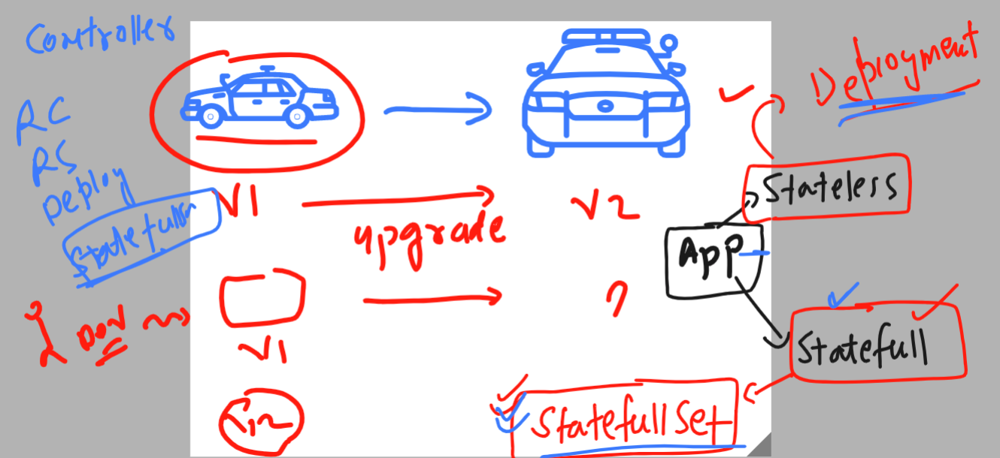

# k8s-cloud4c-b2

## REvision for accessing and deploy app in k8s with External DNS and LB 


### Introduction to the working of Ingress controller 


### using service with Ingress controller or without ingress controller 


### cleaning up namespace data 

```
[ec2-user@docker ashu-docker-images]$ kubectl  config get-contexts 
CURRENT   NAME                          CLUSTER      AUTHINFO           NAMESPACE
*         kubernetes-admin@kubernetes   kubernetes   kubernetes-admin   ashu-space
[ec2-user@docker ashu-docker-images]$ 
[ec2-user@docker ashu-docker-images]$ kubectl get all
NAME                             READY   STATUS    RESTARTS      AGE
pod/ashu-deploy-d4dc9fd9-2vjfp   1/1     Running   1 (56m ago)   22h
pod/ashu-deploy-d4dc9fd9-7lbk9   1/1     Running   1 (56m ago)   22h
pod/ashu-deploy-d4dc9fd9-vghxz   1/1     Running   1 (56m ago)   22h

NAME               TYPE           CLUSTER-IP       EXTERNAL-IP   PORT(S)        AGE
service/ashu-app   LoadBalancer   10.102.134.7     <pending>     80:31481/TCP   23h
service/lb008      NodePort       10.100.228.216   <none>        80:30037/TCP   22h

NAME                          READY   UP-TO-DATE   AVAILABLE   AGE
deployment.apps/ashu-deploy   3/3     3            3           22h

NAME                                   DESIRED   CURRENT   READY   AGE
replicaset.apps/ashu-deploy-d4dc9fd9   3         3         3       22h
[ec2-user@docker ashu-docker-images]$ kubectl  delete all --all
pod "ashu-deploy-d4dc9fd9-2vjfp" deleted
pod "ashu-deploy-d4dc9fd9-7lbk9" deleted
pod "ashu-deploy-d4dc9fd9-vghxz" deleted
service "ashu-app" deleted
service "lb008" deleted
deployment.apps "ashu-deploy" deleted
```

## Demo of app deployment with Ingress 

### web app deployment 
```
[ec2-user@docker ashu-docker-images]$ ls
ashu-k8s-appdeploy  html-sample-app  java-code  python-code  webapps
[ec2-user@docker ashu-docker-images]$ cd ashu-k8s-appdeploy/
[ec2-user@docker ashu-k8s-appdeploy]$ ls
ashu-pod1.yaml   ashu-webapp-rc.yaml  azureimagepod.yaml  day7pod.yaml      mypod.yaml      nodeport.yaml  svcbyrc.yaml
ashupodnew.json  autopod.yaml         day7nodeport.yaml   deployment1.yaml  nodeport4.yaml  secret.yaml    taskday7.yaml
[ec2-user@docker ashu-k8s-appdeploy]$ 
[ec2-user@docker ashu-k8s-appdeploy]$ 
[ec2-user@docker ashu-k8s-appdeploy]$ kubectl  create  deployment  ashu-java-webapp --image=dockerashu/javaweb:v1 --port 8080 --dry-run=client -o yaml  >day11deployment.yaml 
[ec2-user@docker ashu-k8s-appdeploy]$ 

ec2-user@docker ashu-k8s-appdeploy]$ kubectl  apply -f day11deployment.yaml 
deployment.apps/ashu-java-webapp created
[ec2-user@docker ashu-k8s-appdeploy]$ kubectl  get  deploy 
NAME               READY   UP-TO-DATE   AVAILABLE   AGE
ashu-java-webapp   1/1     1            1           11s
[ec2-user@docker ashu-k8s-appdeploy]$ kubectl  get  rs
NAME                         DESIRED   CURRENT   READY   AGE
ashu-java-webapp-cf7d84459   1         1         1       14s
[ec2-user@docker ashu-k8s-appdeploy]$ kubectl  get  pod
NAME                               READY   STATUS    RESTARTS   AGE
ashu-java-webapp-cf7d84459-zcrxr   1/1     Running   0          17s
[ec2-user@docker ashu-k8s-appdeploy]$ 
```

### creating service 

```
ec2-user@docker ashu-k8s-appdeploy]$ kubectl  get  deployment 
NAME               READY   UP-TO-DATE   AVAILABLE   AGE
ashu-java-webapp   1/1     1            1           2m49s
[ec2-user@docker ashu-k8s-appdeploy]$ kubectl expose deployment ashu-java-webapp  --type ClusterIP --port 8080 --name ashulb8 --dry-run=client -o yaml >day11clusteripsvc.yaml 
[ec2-user@docker ashu-k8s-appdeploy]$ kubectl  apply -f day11clusteripsvc.yaml 
service/ashulb8 created
[ec2-user@docker ashu-k8s-appdeploy]$ kubectl  get  svc
NAME      TYPE        CLUSTER-IP       EXTERNAL-IP   PORT(S)    AGE
ashulb8   ClusterIP   10.101.228.139   <none>        8080/TCP   3s
[ec2-user@docker ashu-k8s-appdeploy]$ 
```
### setup of nginx ingress controller in k8s cluster

```
ec2-user@docker ashu-k8s-appdeploy]$ kubectl apply -f https://raw.githubusercontent.com/kubernetes/ingress-nginx/main/deploy/static/provider/baremetal/deploy.yaml
namespace/ingress-nginx created
serviceaccount/ingress-nginx created
serviceaccount/ingress-nginx-admission created
role.rbac.authorization.k8s.io/ingress-nginx created
role.rbac.authorization.k8s.io/ingress-nginx-admission created
clusterrole.rbac.authorization.k8s.io/ingress-nginx created
clusterrole.rbac.authorization.k8s.io/ingress-nginx-admission created
rolebinding.rbac.authorization.k8s.io/ingress-nginx created
rolebinding.rbac.authorization.k8s.io/ingress-nginx-admission created
clusterrolebinding.rbac.authorization.k8s.io/ingress-nginx created
clusterrolebinding.rbac.authorization.k8s.io/ingress-nginx-admission created
configmap/ingress-nginx-controller created
service/ingress-nginx-controller created
```

### verify it 

```
[ec2-user@docker ashu-k8s-appdeploy]$ kubectl -n ingress-nginx  get deploy 
NAME                       READY   UP-TO-DATE   AVAILABLE   AGE
ingress-nginx-controller   1/1     1            1           53s
[ec2-user@docker ashu-k8s-appdeploy]$ kubectl -n ingress-nginx  get pod
NAME                                        READY   STATUS      RESTARTS   AGE
ingress-nginx-admission-create-ctst5        0/1     Completed   0          58s
ingress-nginx-admission-patch-5tjnf         0/1     Completed   0          58s
ingress-nginx-controller-7c8b876764-z9x8n   1/1     Running     0          58s
[ec2-user@docker ashu-k8s-appdeploy]$ kubectl -n ingress-nginx  get  svc
NAME                                 TYPE        CLUSTER-IP      EXTERNAL-IP   PORT(S)                      AGE
ingress-nginx-controller             NodePort    10.108.146.72   <none>        80:30122/TCP,443:32685/TCP   63s
ingress-nginx-controller-admission   ClusterIP   10.101.81.89    <none>        443/TCP                      63s
```

### Ingress yaml 

```
apiVersion: networking.k8s.io/v1
kind: Ingress
metadata:
  name: ashu-route-rule # name of my routing rule 
  annotations:
    nginx.ingress.kubernetes.io/rewrite-target: /
spec:
  ingressClassName: nginx  # class name must be used 
  rules:
  - host: myself.ashutoshh.in # name of website which people will access 
    http:
      paths:
      - path: /  # default location of webapp 
        pathType: Prefix
        backend:
          service:
            name: ashulb8 # name of service of mine 
            port:
              number: 8080
```

### deploy it 

```
[ec2-user@docker ashu-k8s-appdeploy]$ kubectl apply -f ashu-ingress-rule.yaml 
ingress.networking.k8s.io/ashu-route-rule created
[ec2-user@docker ashu-k8s-appdeploy]$ kubectl  get  ingress
NAME              CLASS   HOSTS                 ADDRESS   PORTS   AGE
ashu-route-rule   nginx   myself.ashutoshh.in             80      5s
[ec2-user@docker ashu-k8s-appdeploy]$ 
```

### application upgradation understanding 




