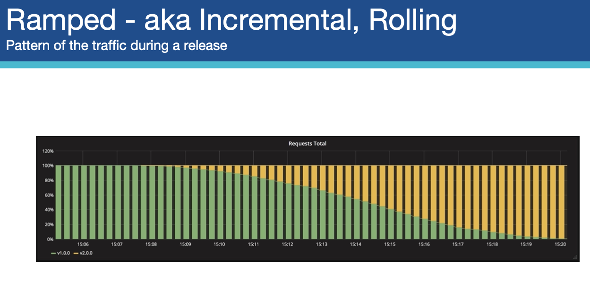

# k8s-cloud4c-b2

### webapp upgradation in k8s using RC | RS can lead to down time 


### cleaning up namespace data 

```
[ec2-user@docker ashu-docker-images]$ kubectl config get-contexts 
CURRENT   NAME                          CLUSTER      AUTHINFO           NAMESPACE
*         kubernetes-admin@kubernetes   kubernetes   kubernetes-admin   ashu-space
[ec2-user@docker ashu-docker-images]$ kubectl  get  all
NAME                                   READY   STATUS    RESTARTS      AGE
pod/ashu-java-webapp-cf7d84459-zcrxr   1/1     Running   1 (37m ago)   23h

NAME              TYPE        CLUSTER-IP       EXTERNAL-IP   PORT(S)    AGE
service/ashulb8   ClusterIP   10.101.228.139   <none>        8080/TCP   23h

NAME                               READY   UP-TO-DATE   AVAILABLE   AGE
deployment.apps/ashu-java-webapp   1/1     1            1           23h

NAME                                         DESIRED   CURRENT   READY   AGE
replicaset.apps/ashu-java-webapp-cf7d84459   1         1         1       23h
[ec2-user@docker ashu-docker-images]$ kubectl  delete all --all
pod "ashu-java-webapp-cf7d84459-zcrxr" deleted
service "ashulb8" deleted
deployment.apps "ashu-java-webapp" deleted
[ec2-user@docker ashu-docker-images]$ kubectl  get  ingress
NAME              CLASS   HOSTS                 ADDRESS         PORTS   AGE
ashu-route-rule   nginx   myself.ashutoshh.in   172.31.23.254   80      23h
[ec2-user@docker ashu-docker-images]$ kubectl  delete ingress ashu-route-rule 
ingress.networking.k8s.io "ashu-route-rule" deleted
[ec2-user@docker ashu-docker-images]$ 
```

### 6 type of strategry we have in deployment controller 


### recreate strategy 


### Ramped or rolling updates 



## First your developer will Design application 

### Developer did its job and we have below docker image 

```
docker.io/dockerashu/customerweb:v1
```

### using this docker image we can create Deployment 

```
ec2-user@docker ashu-docker-images]$ ls
ashu-k8s-appdeploy  html-sample-app  java-code  my-customer-app  python-code  webapps
[ec2-user@docker ashu-docker-images]$ cd ashu-k8s-appdeploy/
[ec2-user@docker ashu-k8s-appdeploy]$ ls
ashu-ingress-rule.yaml  ashu-webapp-rc.yaml  day11clusteripsvc.yaml  day7pod.yaml      nodeport4.yaml  svcbyrc.yaml
ashu-pod1.yaml          autopod.yaml         day11deployment.yaml    deployment1.yaml  nodeport.yaml   taskday7.yaml
ashupodnew.json         azureimagepod.yaml   day7nodeport.yaml       mypod.yaml        secret.yaml
[ec2-user@docker ashu-k8s-appdeploy]$ kubectl create deployment ashu-app --image=docker.io/dockerashu/customerweb:v1 --port 80       --dry-run=client -o yaml >day12deploy.yaml 
[ec2-user@docker ashu-k8s-appdeploy]$ ls
ashu-ingress-rule.yaml  ashu-webapp-rc.yaml  day11clusteripsvc.yaml  day7nodeport.yaml  mypod.yaml      secret.yaml
ashu-pod1.yaml          autopod.yaml         day11deployment.yaml    day7pod.yaml       nodeport4.yaml  svcbyrc.yaml
ashupodnew.json         azureimagepod.yaml   day12deploy.yaml        deployment1.yaml   nodeport.yaml   taskday7.yaml
[ec2-user@docker ashu-k8s-appdeploy]$ kubectl  apply -f day12deploy.yaml 
deployment.apps/ashu-app created
[ec2-user@docker ashu-k8s-appdeploy]$ kubectl  get  deploy 
NAME       READY   UP-TO-DATE   AVAILABLE   AGE
ashu-app   1/1     1            1           4s
[ec2-user@docker ashu-k8s-appdeploy]$ kubectl  get  rs
NAME                  DESIRED   CURRENT   READY   AGE
ashu-app-859878c879   1         1         1       8s
[ec2-user@docker ashu-k8s-appdeploy]$ kubectl  get  po 
NAME                        READY   STATUS    RESTARTS   AGE
ashu-app-859878c879-mp5rx   1/1     Running   0          12s
[ec2-user@docker ashu-k8s-appdeploy]$ 
```

### check default deployment strategy by k8s deployment controller 

```
ec2-user@docker ashu-k8s-appdeploy]$ kubectl  get  deploy 
NAME       READY   UP-TO-DATE   AVAILABLE   AGE
ashu-app   1/1     1            1           5m35s
[ec2-user@docker ashu-k8s-appdeploy]$ 
[ec2-user@docker ashu-k8s-appdeploy]$ kubectl  describe  deploy  ashu-app 
Name:                   ashu-app
Namespace:              ashu-space
CreationTimestamp:      Wed, 07 Jun 2023 12:19:20 +0000
Labels:                 app=ashu-app
Annotations:            deployment.kubernetes.io/revision: 1
Selector:               app=ashu-app
Replicas:               1 desired | 1 updated | 1 total | 1 available | 0 unavailable
StrategyType:           RollingUpdate
MinReadySeconds:        0
RollingUpdateStrategy:  25% max unavailable, 25% max surge
Pod Template:
```

### lets scale pod 

```
[ec2-user@docker ashu-k8s-appdeploy]$ kubectl  get  deploy 
NAME       READY   UP-TO-DATE   AVAILABLE   AGE
ashu-app   1/1     1            1           8m25s
[ec2-user@docker ashu-k8s-appdeploy]$ kubectl  scale deployment ashu-app --replicas 3 
deployment.apps/ashu-app scaled
[ec2-user@docker ashu-k8s-appdeploy]$ kubectl  get  deploy 
NAME       READY   UP-TO-DATE   AVAILABLE   AGE
ashu-app   3/3     3            3           8m36s
[ec2-user@docker ashu-k8s-appdeploy]$ kubectl  get  rs
NAME                  DESIRED   CURRENT   READY   AGE
ashu-app-859878c879   3         3         3       8m41s
[ec2-user@docker ashu-k8s-appdeploy]$ kubectl  get  po
NAME                        READY   STATUS    RESTARTS   AGE
ashu-app-859878c879-9pl2n   1/1     Running   0          10s
ashu-app-859878c879-h67hz   1/1     Running   0          10s
ashu-app-859878c879-mp5rx   1/1     Running   0          8m44s
[ec2-user@docker ashu-k8s-appdeploy]$ 

```

### with no ingress controller we are creating Loadbalancer 

```
[ec2-user@docker ashu-k8s-appdeploy]$ kubectl  get  deploy 
NAME       READY   UP-TO-DATE   AVAILABLE   AGE
ashu-app   3/3     3            3           11m
[ec2-user@docker ashu-k8s-appdeploy]$ kubectl expose deploy  ashu-app --type  LoadBalancer --port 80 --name ashulb8 --dry-run=client  -o yaml >lbday12.yaml 
[ec2-user@docker ashu-k8s-appdeploy]$ kubectl apply -f lbday12.yaml 
service/ashulb8 created
[ec2-user@docker ashu-k8s-appdeploy]$ kubectl  get  svc
NAME      TYPE           CLUSTER-IP       EXTERNAL-IP   PORT(S)        AGE
ashulb8   LoadBalancer   10.106.250.161   <pending>     80:31051/TCP   3s
[ec2-user@docker ashu-k8s-appdeploy]$ 
[ec2-user@docker ashu-k8s-appdeploy]$ 
[ec2-user@docker ashu-k8s-appdeploy]$ kubectl  get  ep 
NAME      ENDPOINTS                                                AGE
ashulb8   192.168.151.178:80,192.168.161.32:80,192.168.255.88:80   10s
[ec2-user@docker ashu-k8s-appdeploy]$ 

```

### update image for updating app 

```
[ec2-user@docker ashu-k8s-appdeploy]$ kubectl  get  deploy 
NAME       READY   UP-TO-DATE   AVAILABLE   AGE
ashu-app   3/3     3            3           23m
[ec2-user@docker ashu-k8s-appdeploy]$ kubectl  set image deployment  ashu-app  customerweb=docker.io/dockerashu/customerweb:v2
deployment.apps/ashu-app image updated
[ec2-user@docker ashu-k8s-appdeploy]$ kubectl  get  deploy 
NAME       READY   UP-TO-DATE   AVAILABLE   AGE
ashu-app   3/3     3            3           24m
[ec2-user@docker ashu-k8s-appdeploy]$ 
[ec2-user@docker ashu-k8s-appdeploy]$ kubectl  get  po
NAME                        READY   STATUS    RESTARTS   AGE
ashu-app-76cbf5c84b-4sjhm   1/1     Running   0          11s
ashu-app-76cbf5c84b-4tj2s   1/1     Running   0          15s
ashu-app-76cbf5c84b-rl7cd   1/1     Running   0          13s
[ec2-user@docker ashu-k8s-appdeploy]$ kubectl  describe deployment   ashu-app 
Name:                   ashu-app
Namespace:              ashu-space
CreationTimestamp:      Wed, 07 Jun 2023 12:19:20 +0000
Labels:                 app=ashu-app
Annotations:            deployment.kubernetes.io/revision: 2
Selector:               app=ashu-app
Replicas:               3 desired | 3 updated | 3 total | 3 available | 0 unavailable
StrategyType:           RollingUpdate
MinReadySeconds:        0
RollingUpdateStrategy:  25% max unavailable, 25% max surge
Pod Template:
  Labels:  app=ashu-app
  Containers:
   customerweb:
    Image:        docker.io/dockerashu/customerweb:v2
    Port:         80/TCP
    Host Port:    0/TCP
    Environment:  <none>
    Mounts:       <none>
  Volumes:        <none>
Conditions:
  Type           Status  Reason
  ----           ------  ------
  Available      True    MinimumReplicasAvailable
  Progressing    True    NewReplicaSetAvailable
OldReplicaSets:  ashu-app-859878c879 (0/0 replicas created)
NewReplicaSet:   ashu-app-76cbf5c84b (3/3 replicas created)
Events:
  Type    Reason             Age   From                   Message
  ----    ------             ----  ----                   -------
  Normal  ScalingReplicaSet  24m   deployment-controller  Scaled up replica set ashu-app-859878c879 to 1
  Normal  ScalingReplicaSet  16m   deployment-controller  Scaled up replica set ashu-app-859878c879 to 3 from 1
  Normal  ScalingReplicaSet  37s   deployment-controller  Scaled up replica set ashu-app-76cbf5c84b to 1
  Normal  ScalingReplicaSet  35s   deployment-controller  Scaled down re
```

### rolling back to previous version 

```
ec2-user@docker ashu-k8s-appdeploy]$ kubectl   get  deploy 
NAME       READY   UP-TO-DATE   AVAILABLE   AGE
ashu-app   3/3     3            3           29m
[ec2-user@docker ashu-k8s-appdeploy]$ 
[ec2-user@docker ashu-k8s-appdeploy]$ kubectl   get  rs
NAME                  DESIRED   CURRENT   READY   AGE
ashu-app-76cbf5c84b   3         3         3       5m16s
ashu-app-859878c879   0         0         0       29m
[ec2-user@docker ashu-k8s-appdeploy]$ kubectl  rollout undo deployment ashu-app 
deployment.apps/ashu-app rolled back
```


