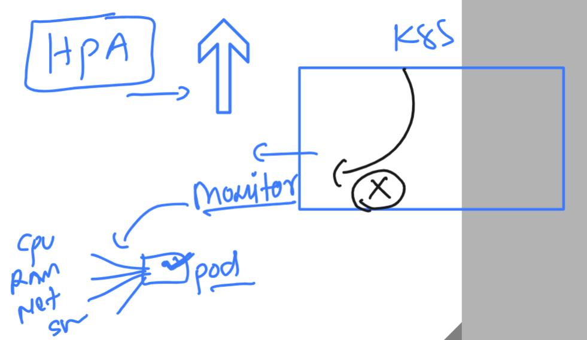
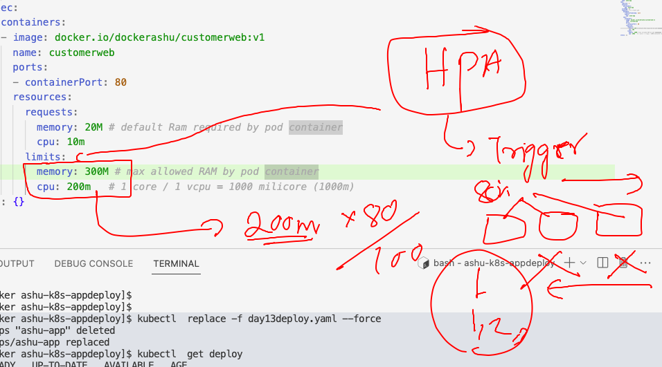

# k8s-cloud4c-b2

### HPA (Horizental pod autoscaler)

### need of monitoring & observability tools



### setup of metric server in k8s 

```
ec2-user@docker ashu-docker-images]$ kubectl apply -f https://raw.githubusercontent.com/redashu/k8s/hpa/hpa/components.yaml
serviceaccount/metrics-server created
clusterrole.rbac.authorization.k8s.io/system:aggregated-metrics-reader created
clusterrole.rbac.authorization.k8s.io/system:metrics-server created
rolebinding.rbac.authorization.k8s.io/metrics-server-auth-reader created
clusterrolebinding.rbac.authorization.k8s.io/metrics-server:system:auth-delegator created
clusterrolebinding.rbac.authorization.k8s.io/system:metrics-server created
service/metrics-server created
deployment.apps/metrics-server created
apiservice.apiregistration.k8s.io/v1beta1.metrics.k8s.io created
```

### lets verify it 

```
ec2-user@docker ashu-docker-images]$ kubectl  get  po -n kube-system    |  grep metric
metrics-server-6859898658-fxmrt                         1/1     Running   0              50s
[ec2-user@docker ashu-docker-images]$ 

```

### checking nodes resources 

```
[ec2-user@docker ashu-docker-images]$ kubectl  top 
Display Resource (CPU/Memory) usage.

 The top command allows you to see the resource consumption for nodes or pods.

 This command requires Metrics Server to be correctly configured and working on the server.

Available Commands:
  node          Display resource (CPU/memory) usage of nodes
  pod           Display resource (CPU/memory) usage of pods

Usage:
  kubectl top [flags] [options]

Use "kubectl <command> --help" for more information about a given command.
Use "kubectl options" for a list of global command-line options (applies to all commands).
[ec2-user@docker ashu-docker-images]$ kubectl  get  nodes
NAME                            STATUS   ROLES           AGE   VERSION
ip-172-31-18-85.ec2.internal    Ready    <none>          18d   v1.26.5
ip-172-31-23-211.ec2.internal   Ready    control-plane   18d   v1.26.5
ip-172-31-23-254.ec2.internal   Ready    <none>          18d   v1.26.5
ip-172-31-27-200.ec2.internal   Ready    <none>          18d   v1.26.5
ip-172-31-29-164.ec2.internal   Ready    <none>          18d   v1.26.5
[ec2-user@docker ashu-docker-images]$ kubectl top node ip-172-31-18-85.ec2.internal 
NAME                           CPU(cores)   CPU%   MEMORY(bytes)   MEMORY%   
ip-172-31-18-85.ec2.internal   49m          2%     434Mi           11%       
[ec2-user@docker ashu-docker-images]$ 
```

## to test HPA 

### Creating deployment 

```
kubectl  create  deployment  ashu-app --image=docker.io/dockerashu/customerweb:v1 --port 80 --dry-run=client -o yaml >day13deploy.yaml 
```

### putting resources limits in pod 

```
apiVersion: apps/v1
kind: Deployment
metadata:
  creationTimestamp: null
  labels:
    app: ashu-app
  name: ashu-app
spec:
  replicas: 1
  selector:
    matchLabels:
      app: ashu-app
  strategy: {}
  template: # to create pod 
    metadata:
      creationTimestamp: null
      labels:
        app: ashu-app
    spec:
      containers:
      - image: docker.io/dockerashu/customerweb:v1
        name: customerweb
        ports:
        - containerPort: 80
        resources:
          requests:
            memory: 20M # default Ram required by pod container
            cpu: 10m  
          limits:
            memory: 300M # max allowed RAM by pod container
            cpu: 200m   # 1 core / 1 vcpu = 1000 milicore (1000m)
status: {}

```

### lets deploy it 

```
[ec2-user@docker ashu-k8s-appdeploy]$ kubectl  apply  -f day13deploy.yaml 

deployment.apps/ashu-app created
[ec2-user@docker ashu-k8s-appdeploy]$ kubectl  get deploy 
NAME       READY   UP-TO-DATE   AVAILABLE   AGE
ashu-app   1/1     1            1           10s
```

### info about pod configuration with HPA 



### creating hpa rules

```
[ec2-user@docker ashu-k8s-appdeploy]$ kubectl  get deploy 
NAME       READY   UP-TO-DATE   AVAILABLE   AGE
ashu-app   1/1     1            1           5m17s
[ec2-user@docker ashu-k8s-appdeploy]$ kubectl  get  po 
NAME                        READY   STATUS    RESTARTS   AGE
ashu-app-6479cff6d5-tf664   1/1     Running   0          5m21s
[ec2-user@docker ashu-k8s-appdeploy]$ 
[ec2-user@docker ashu-k8s-appdeploy]$ 
[ec2-user@docker ashu-k8s-appdeploy]$ kubectl autoscale  deployment ashu-app --min 2 --max 16 --cpu-percent 80 --dry-run=client -o yaml     >hpa.yaml 
[ec2-user@docker ashu-k8s-appdeploy]$ kubectl apply -f hpa.yaml 
horizontalpodautoscaler.autoscaling/ashu-app created
[ec2-user@docker ashu-k8s-appdeploy]$ kubectl  get  hpa
NAME       REFERENCE             TARGETS         MINPODS   MAXPODS   REPLICAS   AGE
ashu-app   Deployment/ashu-app   <unknown>/80%   2         16        0          4s
[ec2-user@docker ashu-k8s-appdeploy]$ 

```

### see pod must have increased

```
ec2-user@docker ashu-k8s-appdeploy]$ kubectl  get  hpa
NAME       REFERENCE             TARGETS   MINPODS   MAXPODS   REPLICAS   AGE
ashu-app   Deployment/ashu-app   0%/80%    2         16        2          40s
[ec2-user@docker ashu-k8s-appdeploy]$ kubectl  get  po 
NAME                        READY   STATUS    RESTARTS   AGE
ashu-app-6479cff6d5-64lks   1/1     Running   0          36s
ashu-app-6479cff6d5-tf664   1/1     Running   0          6m59s
[ec2-user@docker ashu-k8s-appdeploy]$ 
```

### to access app lets create service 

```
ec2-user@docker ashu-k8s-appdeploy]$ kubectl  get  deploy
NAME       READY   UP-TO-DATE   AVAILABLE   AGE
ashu-app   2/2     2            2           11m
[ec2-user@docker ashu-k8s-appdeploy]$ kubectl  expose deployment ashu-app --type NodePort --port 80 --name ss11 
service/ss11 exposed
[ec2-user@docker ashu-k8s-appdeploy]$ kubectl  get  svc
NAME   TYPE       CLUSTER-IP      EXTERNAL-IP   PORT(S)        AGE
ss11   NodePort   10.110.32.201   <none>        80:32043/TCP   5s
[ec2-user@docker ashu-k8s-appdeploy]$ 
```

### yaml with some external process in container 

```
apiVersion: v1
kind: Pod
metadata:
  creationTimestamp: null
  labels:
    run: test1
  name: test1
spec:
  containers:
  - image: alpine
    name: test1
    command: ['sh','-c','sleep 100000000']
    resources: {}
  dnsPolicy: ClusterFirst
  restartPolicy: Always
status: {}

```

### tips to generate from cli

```
[ec2-user@docker ashu-k8s-appdeploy]$ kubectl  run  test1  --image=alpine --dry-run=client -o yaml  -- sleep 1000 
apiVersion: v1
kind: Pod
metadata:
  creationTimestamp: null
  labels:
    run: test1
  name: test1
spec:
  containers:
  - args:
    - sleep
    - "1000"
    image: alpine
    name: test1
    resources: {}
  dnsPolicy: ClusterFirst
  restartPolicy: Always
status: {}
[ec2-user@docker ashu-k8s-appdeploy]$ kubectl  run  test1  --image=alpine  --command sleep 1000          --dry-run=client -o yaml  
apiVersion: v1
kind: Pod
metadata:
  creationTimestamp: null
  labels:
    run: test1
```

## Splunk task solution 

```
498  kubectl  create  ns  ashusplunkns --dry-run=client -o yaml 
  499  kubectl  create  deployment ashu-splunk --image=splunk/splunk:latest  --port 8000 --dry-run=client -o yaml 
  500  kubectl  create  secret 
  501  kubectl  create  secret  generic  mypass  --from-literal   x="Splunk@098#"  --dry-run=client -o yaml 
  502  kubectl  create  service nodeport ashulb9 --tcp 8000:8000 --dry-run=client -o yaml 
```

### final yaml 

```
apiVersion: v1
kind: Namespace
metadata:
  creationTimestamp: null
  name: ashusplunkns
spec: {}
status: {}
---
apiVersion: v1
data:
  x: U3BsdW5rQDA5OCM=
kind: Secret
metadata:
  creationTimestamp: null
  name: mypass
  namespace: ashusplunkns
---
apiVersion: apps/v1
kind: Deployment
metadata:
  creationTimestamp: null
  labels:
    app: ashu-splunk
  name: ashu-splunk
  namespace: ashusplunkns # namespace info 
spec:
  replicas: 1
  selector:
    matchLabels:
      app: ashu-splunk
  strategy: {}
  template:
    metadata:
      creationTimestamp: null
      labels: # label is gonna use by service selector 
        app: ashu-splunk
    spec:
      containers:
      - image: splunk/splunk:latest
        name: splunk
        ports:
        - containerPort: 8000
        resources: {}
        env: # pass values
        - name: SPLUNK_START_ARGS
          value: "--accept-license"
        - name: SPLUNK_PASSWORD
          valueFrom:
            secretKeyRef:
              name: mypass
              key: x
          
status: {}
---
apiVersion: v1
kind: Service
metadata:
  creationTimestamp: null
  labels:
    app: ashulb9
  name: ashulb9
  namespace: ashusplunkns 
spec:
  ports:
  - name: 8000-8000
    port: 8000
    protocol: TCP
    targetPort: 8000
  selector: # matching label of pod here 
    app: ashu-splunk
  type: NodePort
status:
  loadBalancer: {}

```

### deploy it

```
[ec2-user@docker ashu-k8s-appdeploy]$ kubectl apply -f ashusplunk.yaml 
namespace/ashusplunkns created
secret/mypass created
deployment.apps/ashu-splunk created
service/ashulb9 created
[ec2-user@docker ashu-k8s-appdeploy]$ kubectl  -n  ashusplunkns  get  deploy
NAME          READY   UP-TO-DATE   AVAILABLE   AGE
ashu-splunk   1/1     1            1           17s
[ec2-user@docker ashu-k8s-appdeploy]$ kubectl  -n  ashusplunkns  get  po
NAME                          READY   STATUS    RESTARTS   AGE
ashu-splunk-f8fdddfd4-d6xjg   1/1     Running   0          20s
[ec2-user@docker ashu-k8s-appdeploy]$ kubectl  -n  ashusplunkns  get  secret
NAME     TYPE     DATA   AGE
mypass   Opaque   1      23s
[ec2-user@docker ashu-k8s-appdeploy]$ kubectl  -n  ashusplunkns  get  svc
NAME      TYPE       CLUSTER-IP      EXTERNAL-IP   PORT(S)          AGE
ashulb9   NodePort   10.111.31.132   <none>        8000:32174/TCP   26s
[ec2-user@docker ashu-k8s-appdeploy]$ 
```

