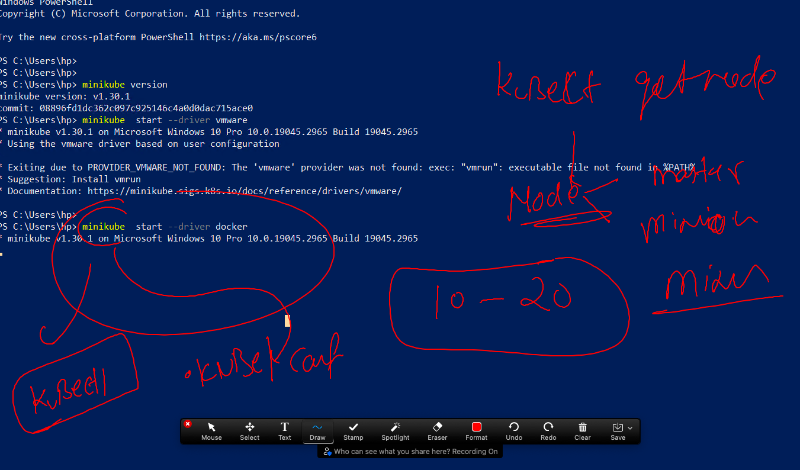
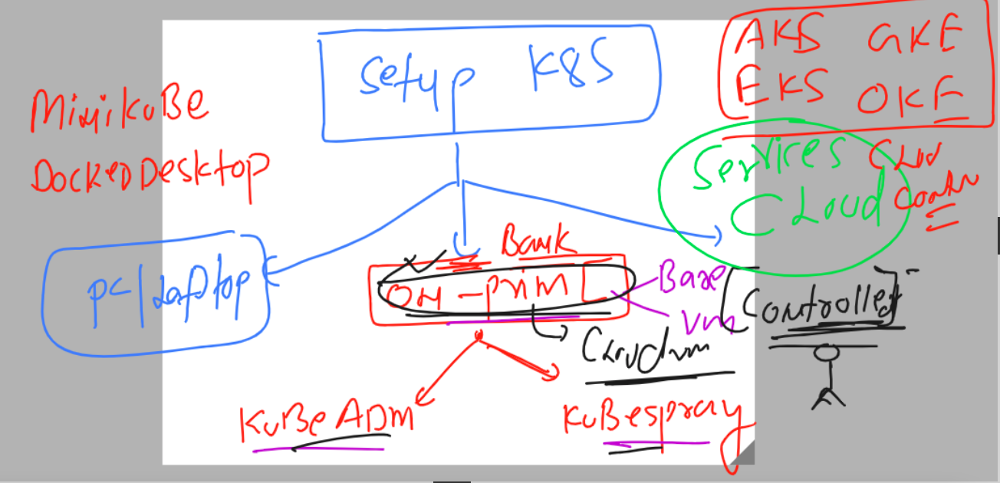

# k8s-cloud4c-b2

### a little understanding of Minikube the local k8s installer 



### overall installation methods understanding 



### setup of 3 node cluster using kubeadm 

## these steps we have to do in every system 

### Install docker or any CRE in all the machine 

```
yum install docker -y 
```

### enable bridge kernel module for CNI support in all the machine 

```
[root@masternode ~]# modprobe br_netfilter
[root@masternode ~]# echo '1' > /proc/sys/net/bridge/bridge-nf-call-iptables
[root@masternode ~]# 

```

### COnfigure Docker to support k8s 

```
cat  <<X  >/etc/docker/daemon.json
{
  "exec-opts": ["native.cgroupdriver=systemd"]
}

X
```

### starting docker 

```
 systemctl start docker ; systemctl enable docker
```

###  setup for kubeadm installation on all the machine 

```
cat  <<EOF  >/etc/yum.repos.d/kube.repo
[kube]
baseurl=https://packages.cloud.google.com/yum/repos/kubernetes-el7-x86_64
gpgcheck=0
EOF

yum install kubeadm -y 
```


# Step only we have to do in master system 

```
[root@masternode ~]# kubeadm  init  --pod-network-cidr=192.168.0.0/16  --apiserver-advertise-address=0.0.0.0  --apiserver-cert-extra-sans=54.211.71.250 
[init] Using Kubernetes version: v1.27.2
[preflight] Running pre-flight checks
	[WARNING FileExisting-tc]: tc no
```

### after above command on master we get below response

```
To start using your cluster, you need to run the following as a regular user:

  mkdir -p $HOME/.kube
  sudo cp -i /etc/kubernetes/admin.conf $HOME/.kube/config
  sudo chown $(id -u):$(id -g) $HOME/.kube/config

Alternatively, if you are the root user, you can run:

  export KUBECONFIG=/etc/kubernetes/admin.conf

You should now deploy a pod network to the cluster.
Run "kubectl apply -f [podnetwork].yaml" with one of the options listed at:
  https://kubernetes.io/docs/concepts/cluster-administration/addons/

Then you can join any number of worker nodes by running the following on each as root:

kubeadm join 172.31.82.88:6443 --token mav5ih.e5hn6ggnfnio4hot \
	--discovery-token-ca-cert-hash sha
```

### setup kubeconfig in master 

```
~]#  mkdir -p $HOME/.kube
[root@masternode ~]# cp -i /etc/kubernetes/admin.conf $HOME/.kube/config

```


## last step will be done in worker to join master 

```
kubeadm join 172.31.82.88:6443 --token mav5ih.e5hn6ggnfnio4hot --discovery-token-ca-cert-hash sha256:82392dfb3971c8b65aa01309c504ebf11
```

### lets check back in master 

```
[root@masternode ~]# kubectl  get  nodes
NAME         STATUS     ROLES           AGE     VERSION
masternode   NotReady   control-plane   3m14s   v1.27.2
node1        NotReady   <none>          103s    v1.27.2
node2        NotReady   <none>          92s     v1.27.2
[root@masternode ~]# 

```

### implement CNI plugin to make nodes in ready state

```
[root@masternode ~]# kubectl apply -f https://raw.githubusercontent.com/projectcalico/calico/v3.25.0/manifests/calico.yaml
poddisruptionbudget.policy/calico-kube-controllers created
serviceaccount/calico-kube-controllers created
serviceaccount/calico-node created
configmap/calico-config created
customresourcedefinition.apiextensions.k
```

### check again 

```
[root@masternode ~]# kubectl  get  nodes
NAME         STATUS   ROLES           AGE     VERSION
masternode   Ready    control-plane   5m16s   v1.27.2
node1        Ready    <none>          3m45s   v1.27.2
node2        Ready    <none>          3m34s   v1.27.2

```

### Client setup on windows. by download kubectl and testing it 

```
PS C:\Users\hp> cd .\Downloads\
PS C:\Users\hp\Downloads>
PS C:\Users\hp\Downloads> .\kubectl.exe  version -o yaml
clientVersion:
  buildDate: "2023-05-17T14:20:07Z"
  compiler: gc
  gitCommit: 7f6f68fdabc4df88cfea2dcf9a19b2b830f1e647
  gitTreeState: clean
  gitVersion: v1.27.2
  goVersion: go1.20.4
  major: "1"
  minor: "27"
  platform: windows/amd64
kustomizeVersion: v5.0.1

Unable to connect to the server: dial tcp 127.0.0.1:6443: connectex: No connection could be made because the target machine actively refused it.
PS C:\Users\hp\Downloads>

```

### Download and copy kubeconfig to home directory of current user by the name of config

```
PS C:\Users\hp\Downloads> mkdir  ~/.kube


    Directory: C:\Users\hp


Mode                 LastWriteTime         Length Name
----                 -------------         ------ ----
d-----          6/9/2023   6:13 AM                .kube


PS C:\Users\hp\Downloads> cp -v .\admin.conf.txt   C:\Users\hp\.kube\config
VERBOSE: Performing the operation "Copy File" on target "Item: C:\Users\hp\Downloads\admin.conf.txt Destination: C:\Users\hp\.kube\config".
PS C:\Users\hp\Downloads>
PS C:\Users\hp\Downloads>
PS C:\Users\hp\Downloads> kubectl get  nodes
NAME         STATUS   ROLES           AGE   VERSION
masternode   Ready    control-plane   18m   v1.27.2
node1        Ready    <none>          17m   v1.27.2
node2        Ready    <none>          16m   v1.27.2
PS C:\Users\hp\Downloads> kubectl get  nodes
NAME         STATUS   ROLES           AGE   VERSION
masternode   Ready    control-plane   19m   v1.27.2
```


