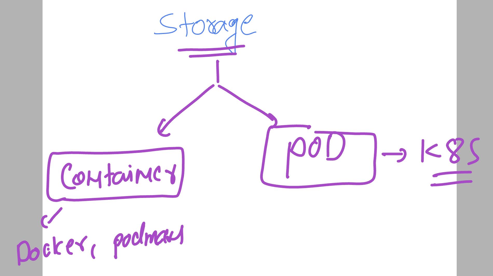
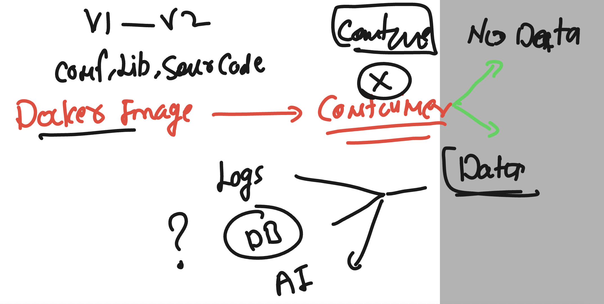
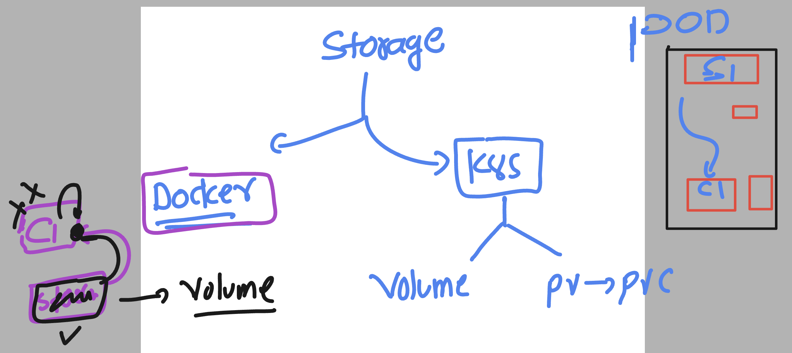
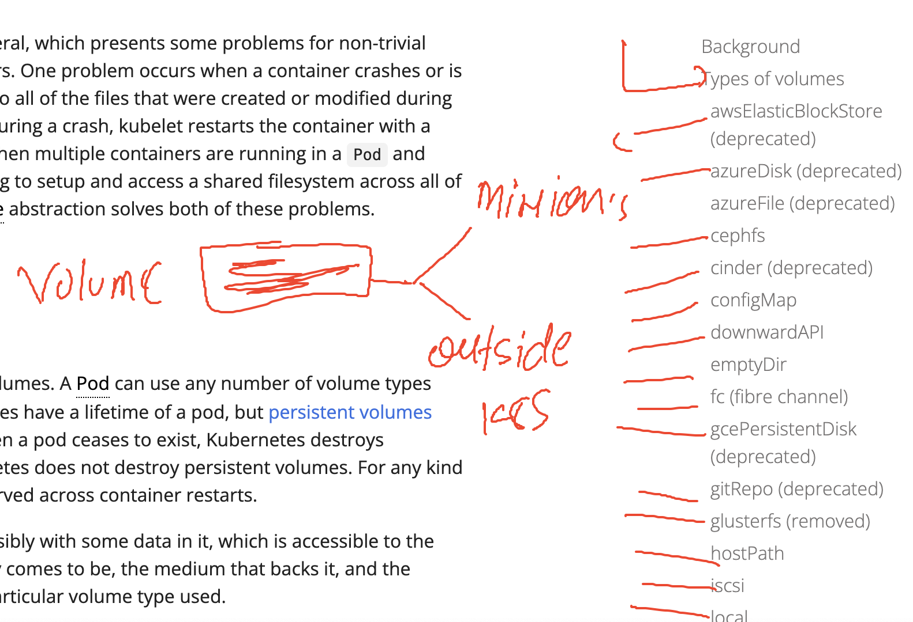
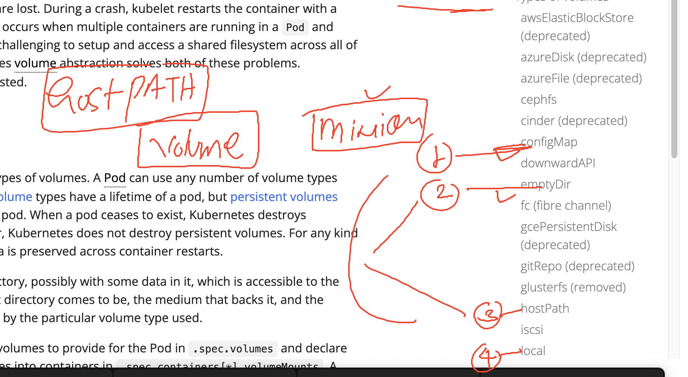

# k8s-cloud4c-b2

# Introduction to storage



### container are not persistent in nature 



### Storage in docker and k8s 



## Volume storage sources 



### hostpath storage type in k8s 



### testing lab connection and delete it all

```
[ec2-user@docker ashu-docker-images]$ 
[ec2-user@docker ashu-docker-images]$ kubectl config get-contexts 
CURRENT   NAME                          CLUSTER      AUTHINFO           NAMESPACE
*         kubernetes-admin@kubernetes   kubernetes   kubernetes-admin   ashu-space
[ec2-user@docker ashu-docker-images]$ kubectl  get all
NAME        READY   STATUS    RESTARTS      AGE
pod/test1   1/1     Running   2 (52m ago)   3d23h
[ec2-user@docker ashu-docker-images]$ kubectl  delete all --all
pod "test1" deleted


```

### testing pod with no storage 

```
apiVersion: v1
kind: Pod
metadata:
  creationTimestamp: null
  labels:
    run: ashupod
  name: ashupod
spec:
  containers:
  - image: alpine
    name: ashupod
    command: ['sh','-c','while true;do echo hey all >>/mnt/ashu.txt;sleep 15;done']
    resources: {}
  dnsPolicy: ClusterFirst
  restartPolicy: Always
status: {}

```

### lets deploy it 

```
[ec2-user@docker ashu-k8s-appdeploy]$ kubectl  apply -f no_storage.yaml 
pod/ashupod created

[ec2-user@docker ashu-k8s-appdeploy]$ kubectl  get  po
NAME      READY   STATUS    RESTARTS   AGE
ashupod   1/1     Running   0          9s
[ec2-user@docker ashu-k8s-appdep
```

### verify data 

```
[ec2-user@docker ashu-k8s-appdeploy]$ kubectl  get  po
NAME      READY   STATUS    RESTARTS   AGE
ashupod   1/1     Running   0          3m37s
[ec2-user@docker ashu-k8s-appdeploy]$ 
[ec2-user@docker ashu-k8s-appdeploy]$ kubectl  exec -it  ashupod -- sh 
/ # ls
bin    dev    etc    home   lib    media  mnt    opt    proc   root   run    sbin   srv    sys    tmp    usr    var
/ # cd  /mnt/
/mnt # ls
ashu.txt
/mnt # cat  -n ashu.txt 
     1  hey all
     2  hey all
     3  hey all
     4  hey all
     5  hey all
     6  hey all
     7  hey all
     8  hey all
     9  hey all
    10  hey all
    11  hey all
    12  hey all
    13  hey all
    14  hey all
    15  hey all
    16  hey all
/mnt # exit
[ec2-user@docker ashu-k8s-appdeploy]$ 
```

### delete pod and create 

```

[ec2-user@docker ashu-k8s-appdeploy]$ kubectl delete pod ashupod 
pod "ashupod" deleted

[ec2-user@docker ashu-k8s-appdeploy]$ kubectl  apply -f no_storage.yaml 
pod/ashupod created
[ec2-user@docker ashu-k8s-appdeploy]$ kubectl  get  po 
NAME      READY   STATUS    RESTARTS   AGE
ashupod   1/1     Running   0          2s
[ec2-user@docker ashu-k8s-appdeploy]$ kubectl  exec -it  ashupod -- sh 
/ # cd /mnt/
/mnt # ls
ashu.txt
/mnt # cat -n ashu.txt 
     1  hey all
/mnt # exit
[ec2-user@docker ashu-k8s-appdeploy]$ 

```


