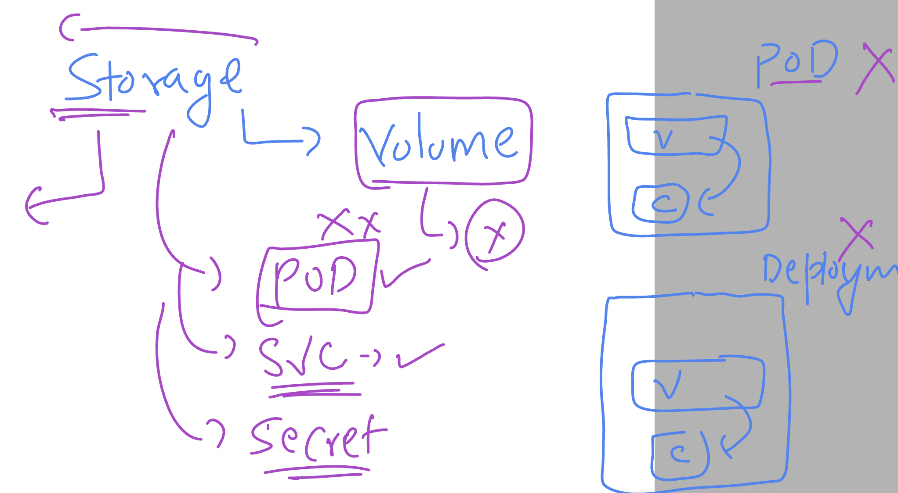
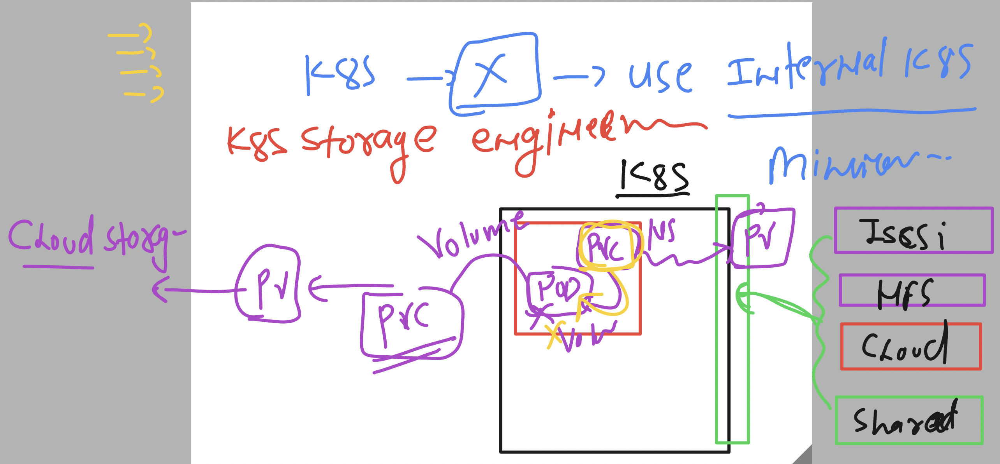
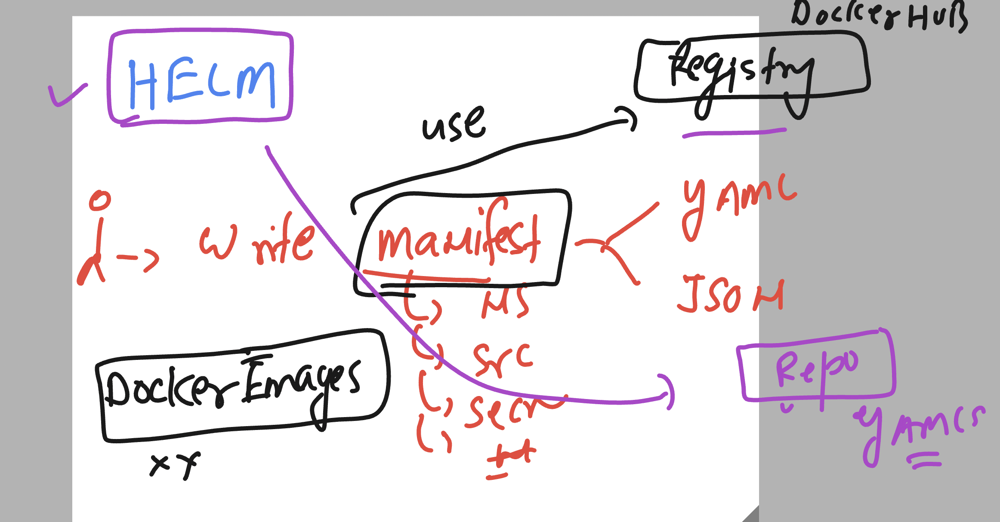
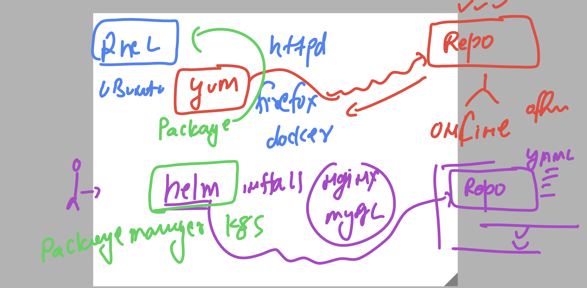
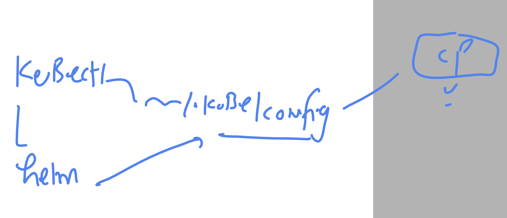
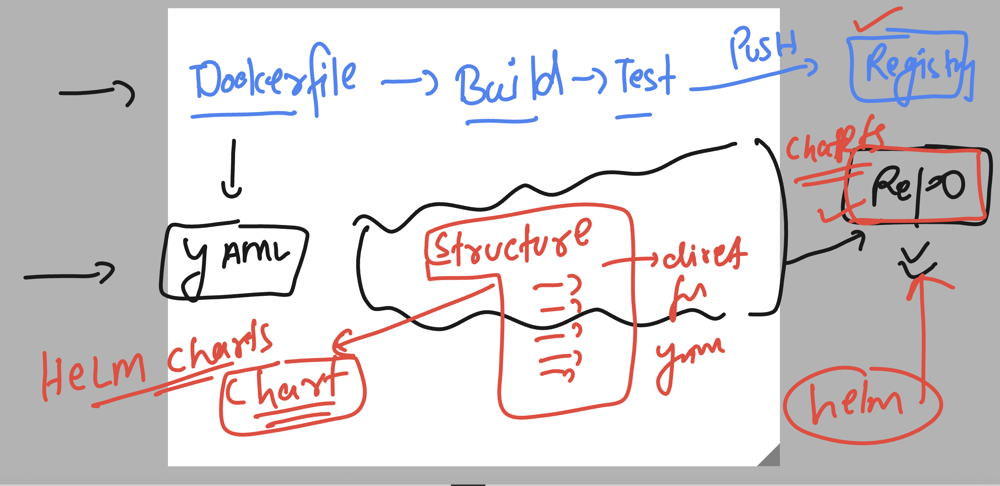
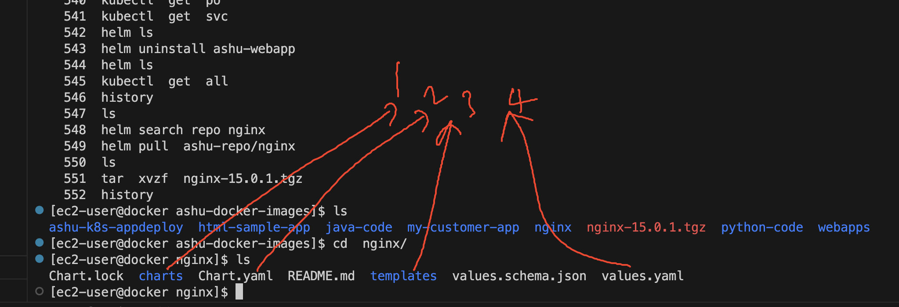

# k8s-cloud4c-b2

### volume as of now is not a seperate resource in k8s 


### Understanding pv & pvc 



### Deploy k8s app using existing YAML on some Repo / server using -- HELM 



## one more Understanding -- The K8s package manager 



### working of helm is same as kubectl 




### installing helm in k8s client machine 

```
[root@docker ~]# wget https://get.helm.sh/helm-v3.12.0-linux-amd64.tar.gz
--2023-06-13 12:24:47--  https://get.helm.sh/helm-v3.12.0-linux-amd64.tar.gz
Resolving get.helm.sh (get.helm.sh)... 152.195.19.97, 2606:2800:11f:1cb7:261b:1f9c:2074:3c
Connecting to get.helm.sh (get.helm.sh)|152.195.19.97|:443... connected.
HTTP request sent, awaiting response... 200 OK
Length: 16041949 (15M) [application/x-tar]
Saving to: ‘helm-v3.12.0-linux-amd64.tar.gz’

100%[==========================================================================================>] 16,041,949  --.-K/s   in 0.1s    

2023-06-13 12:24:47 (146 MB/s) - ‘helm-v3.12.0-linux-amd64.tar.gz’ saved [16041949/16041949]

[root@docker ~]# ls
helm-v3.12.0-linux-amd64.tar.gz  users.txt
[root@docker ~]# tar xvzf helm-v3.12.0-linux-amd64.tar.gz 
linux-amd64/
linux-amd64/helm
linux-amd64/README.md
linux-amd64/LICENSE
[root@docker ~]# ls
helm-v3.12.0-linux-amd64.tar.gz  linux-amd64  users.txt
[root@docker ~]# cd linux-amd64/
[root@docker linux-amd64]# ls
helm  LICENSE  README.md
[root@docker linux-amd64]# mv helm  /usr/bin/
[root@docker linux-amd64]# helm version 
version.BuildInfo{Version:"v3.12.0", GitCommit:"c9f554d75773799f72ceef38c51210f1842a1dea", GitTreeState:"clean", GoVersion:"go1.20.3"}
[root@docker linux-amd64]# 
```

### verify it 

```
ec2-user@docker ashu-docker-images]$ helm version 
WARNING: Kubernetes configuration file is group-readable. This is insecure. Location: /home/ec2-user/.kube/config
WARNING: Kubernetes configuration file is world-readable. This is insecure. Location: /home/ec2-user/.kube/config
version.BuildInfo{Version:"v3.12.0", GitCommit:"c9f554d75773799f72ceef38c51210f1842a1dea", GitTreeState:"clean", GoVersion:"go1.20.3"}
[ec2-user@docker ashu-docker-images]$ 
[ec2-user@docker ashu-docker-images]$ 
[ec2-user@docker ashu-docker-images]$ chmod  600  /home/ec2-user/.kube/config
[ec2-user@docker ashu-docker-images]$ 
[ec2-user@docker ashu-docker-images]$ helm version 
version.BuildInfo{Version:"v3.12.0", GitCommit:"c9f554d75773799f72ceef38c51210f1842a1dea", GitTreeState:"clean", GoVersion:"go1.20.3"}
[ec2-user@docker ashu-docker-images]$ 

```

## Lets get started with HELM 

### By default Helm does not have any repo link

```
[ec2-user@docker ashu-docker-images]$ helm repo list
Error: no repositories to show
[ec2-user@docker ashu-docker-images]$ 

```

### adding repos 

```
[ec2-user@docker ashu-docker-images]$ helm repo list
Error: no repositories to show
[ec2-user@docker ashu-docker-images]$ helm repo add ashu-repo https://charts.bitnami.com/bitnami 
"ashu-repo" has been added to your repositories
[ec2-user@docker ashu-docker-images]$ 
[ec2-user@docker ashu-docker-images]$ helm repo list
NAME            URL                               
ashu-repo       https://charts.bitnami.com/bitnami
[ec2-user@docker ashu-docker-images]$ 

```

### search for package in repo 

```
[ec2-user@docker ashu-docker-images]$ helm search  repo  nginx 
NAME                                    CHART VERSION   APP VERSION     DESCRIPTION                                       
ashu-repo/nginx                         15.0.1          1.25.0          NGINX Open Source is a web server that can be a...
ashu-repo/nginx-ingress-controller      9.7.2           1.8.0           NGINX Ingress Controller is an Ingress controll...
ashu-repo/nginx-intel                   2.1.15          0.4.9           DEPRECATED NGINX Open Source for Intel is a lig...
[ec2-user@docker ashu-docker-images]$ helm search  repo  mysql
NAME                            CHART VERSION   APP VERSION     DESCRIPTION                                       
ashu-repo/mysql                 9.10.4          8.0.33          MySQL is a fast, reliable, scalable, and easy t...
ashu-repo/phpmyadmin            11.1.2          5.2.1           phpMyAdmin is a free software tool written in P...
ashu-repo/mariadb               12.2.5          10.11.4         MariaDB is an open source, community-developed ...
ashu-repo/mariadb-galera        8.2.5           10.11.4         MariaDB Galera is a multi-primary database clus...
[ec2-user@docker ashu-docker-images]$ 
```

### deploy webapp of nginx using helm package 

```
[ec2-user@docker ashu-docker-images]$ helm search  repo  nginx 
NAME                                    CHART VERSION   APP VERSION     DESCRIPTION                                       
ashu-repo/nginx                         15.0.1          1.25.0          NGINX Open Source is a web server that can be a...
ashu-repo/nginx-ingress-controller      9.7.2           1.8.0           NGINX Ingress Controller is an Ingress controll...
ashu-repo/nginx-intel                   2.1.15          0.4.9           DEPRECATED NGINX Open Source for Intel is a lig...
[ec2-user@docker ashu-docker-images]$ kubectl get all
No resources found in ashu-space namespace.
[ec2-user@docker ashu-docker-images]$ 
[ec2-user@docker ashu-docker-images]$ helm install  ashu-webapp  ashu-repo/nginx  
NAME: ashu-webapp
LAST DEPLOYED: Tue Jun 13 12:38:16 2023
NAMESPACE: ashu-space
STATUS: deployed
REVISION: 1
TEST SUITE: None
```

### verify it 

```
[ec2-user@docker ashu-docker-images]$ helm ls
NAME            NAMESPACE       REVISION        UPDATED                                 STATUS          CHART           APP VERSION
ashu-webapp     ashu-space      1               2023-06-13 12:38:16.871419244 +0000 UTC deployed        nginx-15.0.1    1.25.0     
[ec2-user@docker ashu-docker-images]$ 
[ec2-user@docker ashu-docker-images]$ 
[ec2-user@docker ashu-docker-images]$ 
[ec2-user@docker ashu-docker-images]$ kubectl  get  deploy
NAME                READY   UP-TO-DATE   AVAILABLE   AGE
ashu-webapp-nginx   1/1     1            1           80s
[ec2-user@docker ashu-docker-images]$ kubectl  get  rs
NAME                          DESIRED   CURRENT   READY   AGE
ashu-webapp-nginx-8d465c59c   1         1         1       86s
[ec2-user@docker ashu-docker-images]$ 
[ec2-user@docker ashu-docker-images]$ kubectl  get  po
NAME                                READY   STATUS    RESTARTS   AGE
ashu-webapp-nginx-8d465c59c-cqwrc   1/1     Running   0          90s
[ec2-user@docker ashu-docker-images]$ kubectl  get  svc
NAME                TYPE           CLUSTER-IP     EXTERNAL-IP   PORT(S)        AGE
ashu-webapp-nginx   LoadBalancer   10.107.53.44   <pending>     80:30622/TCP   93s
[ec2-user@docker ashu-docker-images]$ 
```

### we can uninstall -- delete in kubectl 

```
[ec2-user@docker ashu-docker-images]$ helm ls
NAME            NAMESPACE       REVISION        UPDATED                                 STATUS          CHART           APP VERSION
ashu-webapp     ashu-space      1               2023-06-13 12:38:16.871419244 +0000 UTC deployed        nginx-15.0.1    1.25.0     
[ec2-user@docker ashu-docker-images]$ 
[ec2-user@docker ashu-docker-images]$ helm uninstall ashu-webapp 
release "ashu-webapp" uninstalled
[ec2-user@docker ashu-docker-images]$ helm uninstall ashu-webapp 
Error: uninstall: Release not loaded: ashu-webapp: release: not found
[ec2-user@docker ashu-docker-images]$ helm ls
NAME    NAMESPACE       REVISION        UPDATED STATUS  CHART   APP VERSION
[ec2-user@docker ashu-docker-images]$ 
[ec2-user@docker ashu-docker-images]$ kubectl  get  all
No resources found in ashu-space namespace.
[ec2-user@docker ashu-docker-images]$ 
```

## Introduction to Understanding helm package -- which is technically knows as CHart -- HELM chart 



### pulling and existing helm chart to understanding few points and structure 

```
[ec2-user@docker ashu-docker-images]$ helm search repo nginx 
NAME                                    CHART VERSION   APP VERSION     DESCRIPTION                                       
ashu-repo/nginx                         15.0.1          1.25.0          NGINX Open Source is a web server that can be a...
ashu-repo/nginx-ingress-controller      9.7.2           1.8.0           NGINX Ingress Controller is an Ingress controll...
ashu-repo/nginx-intel                   2.1.15          0.4.9           DEPRECATED NGINX Open Source for Intel is a lig...
[ec2-user@docker ashu-docker-images]$ 
[ec2-user@docker ashu-docker-images]$ 
[ec2-user@docker ashu-docker-images]$ helm pull  ashu-repo/nginx  
[ec2-user@docker ashu-docker-images]$ ls
ashu-k8s-appdeploy  html-sample-app  java-code  my-customer-app  nginx-15.0.1.tgz  python-code  webapps
[ec2-user@docker ashu-docker-images]$ 

```

### lets extract the charts of nginx app

```
[ec2-user@docker ashu-docker-images]$ ls
ashu-k8s-appdeploy  html-sample-app  java-code  my-customer-app  nginx-15.0.1.tgz  python-code  webapps
[ec2-user@docker ashu-docker-images]$ 
[ec2-user@docker ashu-docker-images]$ tar  xvzf  nginx-15.0.1.tgz 
nginx/Chart.yaml
nginx/Chart.lock
nginx/values.yaml
nginx/values.schema.json
nginx/templates/NOTES.txt
```

### lets see now

```
[ec2-user@docker ashu-docker-images]$ ls
ashu-k8s-appdeploy  html-sample-app  java-code  my-customer-app  nginx  nginx-15.0.1.tgz  python-code  webapps
[ec2-user@docker ashu-docker-images]$ 
[ec2-user@docker ashu-docker-images]$ ls  nginx
Chart.lock  charts  Chart.yaml  README.md  templates  values.schema.json  values.yaml
[ec2-user@docker ashu-docker-images]$ 


```

### 




