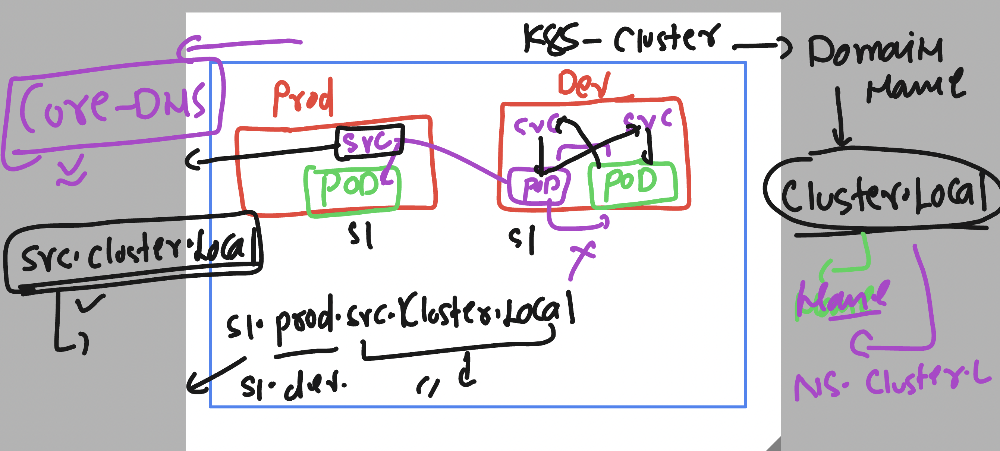

# k8s-cloud4c-b2

### Project details 


## Solution 

###  create a directory 

```
ec2-user@docker ashu-docker-images]$ mkdir  project1/
```

### creating yaml files 

## Creating Namespace and secret 

```
[ec2-user@docker ashu-docker-images]$ cd project1/
[ec2-user@docker project1]$ ls
[ec2-user@docker project1]$ kubectl  create ns ashu-project1 --dry-run=client -o yaml  >ns.yaml 
[ec2-user@docker project1]$ 
[ec2-user@docker project1]$ kubectl apply -f ../project1/
namespace/ashu-project1 created
[ec2-user@docker project1]$ kubectl apply -f . 
namespace/ashu-project1 configured
[ec2-user@docker project1]$ kubectl create  secret generic db-details  --namespace  ashu-project1  --from-literal  mypass="Db123#"    --dry-run=client -o yaml >secret.yaml 
[ec2-user@docker project1]$ 

[ec2-user@docker project1]$ kubectl apply -f . 
namespace/ashu-project1 configured
secret/db-details created
```


### creating deployment of database 

```
[ec2-user@docker project1]$ kubectl create  deployment  ashu-db --image mysql --port 3306 --namespace ashu-project1 --dry-run=client -o yaml  >db_deploy.yaml 
```

### updating secret 

```
apiVersion: apps/v1
kind: Deployment
metadata:
  creationTimestamp: null
  labels:
    app: ashu-db
  name: ashu-db
  namespace: ashu-project1
spec:
  replicas: 1
  selector:
    matchLabels:
      app: ashu-db
  strategy: {}
  template: # template sec of pod 
    metadata:
      creationTimestamp: null
      labels:
        app: ashu-db
    spec:
      containers:
      - image: mysql
        name: mysql
        ports:
        - containerPort: 3306
        resources: {}
        env: # updating env to consume secret 
        - name: MYSQL_ROOT_PASSWORD
          valueFrom:
            secretKeyRef:
              name: db-details
              key: mypass
status: {}

```

###  hostpath volume as well

```
apiVersion: apps/v1
kind: Deployment
metadata:
  creationTimestamp: null
  labels:
    app: ashu-db
  name: ashu-db
  namespace: ashu-project1
spec:
  replicas: 1
  selector:
    matchLabels:
      app: ashu-db
  strategy: {}
  template: # template sec of pod 
    metadata:
      creationTimestamp: null
      labels:
        app: ashu-db
    spec:
      volumes: 
      - name: ashu-db-vol
        hostPath:
          path: /ashu-project1-db
          type: DirectoryOrCreate 
      containers:
      - image: mysql
        name: mysql
        ports:
        - containerPort: 3306
        resources: {}
        volumeMounts:
        - name: ashu-db-vol
          mountPath: /var/lib/mysql/
        env: # updating env to consume secret 
        - name: MYSQL_ROOT_PASSWORD
          valueFrom:
            secretKeyRef:
              name: db-details
              key: mypass
status: {}

```

### lets create service yaml 

```
[ec2-user@docker project1]$ kubectl create service 
Create a service using a specified subcommand.

Aliases:
service, svc

Available Commands:
  clusterip      Create a ClusterIP service
  externalname   Create an ExternalName service
  loadbalancer   Create a LoadBalancer service
  nodeport       Create a NodePort service

Usage:
  kubectl create service [flags] [options]

Use "kubectl <command> --help" for more information about a given command.
Use "kubectl options" for a list of global command-line options (applies to all commands).
[ec2-user@docker project1]$ kubectl create service clusterip ashu-db-lv --tcp 3306:3306  --namespace ashu-project1 --dry-run=client -o yaml >db_svc.yaml 
```

### update label of db pod in service selector 

```
apiVersion: v1
kind: Service
metadata:
  creationTimestamp: null
  labels:
    app: ashu-db-lv
  name: ashu-db-lv
  namespace: ashu-project1
spec:
  ports:
  - name: 3306-3306
    port: 3306
    protocol: TCP
    targetPort: 3306
  selector: # pod finder info 
    app: ashu-db # label of pod 
  type: ClusterIP
status:
  loadBalancer: {}

```

### final deploy 

```
[ec2-user@docker project1]$ kubectl apply -f .
deployment.apps/ashu-db configured
service/ashu-db-lv created
namespace/ashu-project1 configured
secret/db-details configured
[ec2-user@docker project1]$ 
```

### lets verify that 

```
[ec2-user@docker project1]$ kubectl  -n ashu-project1 get po 
NAME                       READY   STATUS    RESTARTS   AGE
ashu-db-678fbccbd6-lw6zl   1/1     Running   0          3m36s
[ec2-user@docker project1]$ kubectl  -n ashu-project1  exec -it ashu-db-678fbccbd6-lw6zl -- bash 
bash-4.4# mysql -u root -p
Enter password: 
Welcome to the MySQL monitor.  Commands end with ; or \g.
Your MySQL connection id is 8
Server version: 8.0.33 MySQL Community Server - GPL

Copyright (c) 2000, 2023, Oracle and/or its affiliates.

Oracle is a registered trademark of Oracle Corporation and/or its
affiliates. Other names may be trademarks of their respective
owners.

Type 'help;' or '\h' for help. Type '\c' to clear the current input statement.

mysql> exit
Bye
```

### also deploy web app image

```
[ec2-user@docker project1]$ kubectl  -n ashu-project1  get  deploy 
NAME       READY   UP-TO-DATE   AVAILABLE   AGE
ashu-db    1/1     1            1           8m56s
ashu-web   1/1     1            1           109s
[ec2-user@docker project1]$ kubectl  -n ashu-project1  get  svc
NAME          TYPE        CLUSTER-IP       EXTERNAL-IP   PORT(S)          AGE
ashu-db-lv    ClusterIP   10.100.27.16     <none>        3306/TCP         6m11s
ashu-web-lb   NodePort    10.108.106.221   <none>        8080:30877/TCP   14s
[ec2-user@docker project1]$ kubectl  -n ashu-project1  get  po
NAME                        READY   STATUS    RESTARTS   AGE
ashu-db-678fbccbd6-lw6zl    1/1     Running   0          9m3s
ashu-web-7d48459cc8-zkn2w   1/1     Running   0          116s
[ec2-user@docker project1]$ kubectl  -n ashu-project1  get  secrets 
NAME         TYPE     DATA   AGE
db-details   Opaque   1      13m
```

### DNS in k8s 

### Core Dns 




