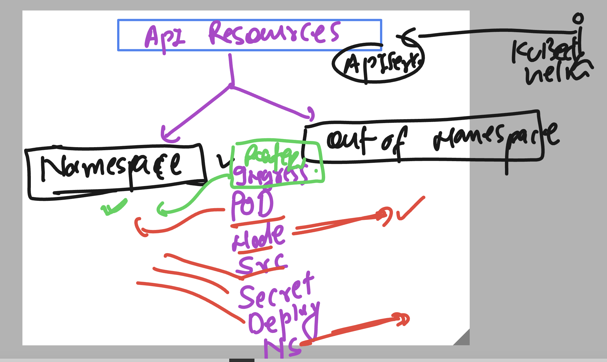
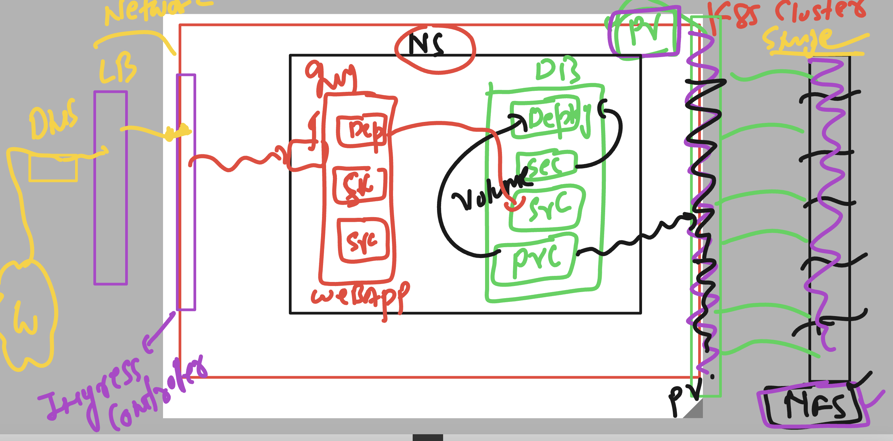

# k8s-cloud4c-b2

### Understanding api-resouces in namespace context 



### checking resources listing 

```
[ec2-user@docker ashu-docker-images]$ kubectl api-resources 
NAME                              SHORTNAMES   APIVERSION                             NAMESPACED   KIND
bindings                                       v1                                     true         Binding
componentstatuses                 cs           v1                                     false        ComponentStatus
configmaps                        cm           v1                                     true         ConfigMap
endpoints                         ep           v1                                     true         Endpoints
events                            ev           v1                                     true         Event
limitranges                       limits       v1                                     true         LimitRange
namespaces                        ns           v1                                     false        Namespace
nodes                             no           v1                                     false        Node
persistentvolumeclaims            pvc          v1                                     true         PersistentVolumeClaim
persistentvolumes                 pv           v1                                     false        PersistentVo
```

## Project  2 



### creating directory structure of project2

```
[ec2-user@docker ashu-docker-images]$ mkdir  projec2 
[ec2-user@docker ashu-docker-images]$ cd  projec
bash: cd: projec: No such file or directory
[ec2-user@docker ashu-docker-images]$ cd  projec2
[ec2-user@docker projec2]$ ls
[ec2-user@docker projec2]$ 
```

# Now time for Resources 

## part 1 -- Db deployment 
### creating Persistent volume (pv)-- generally storage team will be doing 

```
# generally this will be done by Storage team 
apiVersion: v1
kind: PersistentVolume
metadata:
  name: volume-ashu
spec:
  capacity:
    storage: 4Gi # we are requestin 4 gb space from external source (3 to 10 )
  accessModes:
  - ReadWriteOnce 
  storageClassName: manual # we are creating it manualy 
  nfs:
    server: 172.31.24.255
    path: /data-db/john/
```

### deploy it 

```
ec2-user@docker projec2]$ kubectl apply -f pv.yaml 
persistentvolume/volume-ashu created
[ec2-user@docker projec2]$ kubectl get pv
NAME          CAPACITY   ACCESS MODES   RECLAIM POLICY   STATUS      CLAIM                      STORAGECLASS   REASON   AGE
mysql-pv      10Gi       RWO            Retain           Bound       venkat-projet1/mysql-pvc                           23h
volume-ashu   4Gi        RWO            Retain           Available                              manual                  19s
[ec2-user@docker projec2]$ 
```

### create pvc 

```
apiVersion: v1
kind: PersistentVolumeClaim
metadata:
  name: ashu-db-pvc
spec:
  accessModes:
  - ReadWriteOnce
  storageClassName: manual
  resources:
    requests:
      storage: 4Gi 
```
###
```
[ec2-user@docker projec2]$ kubectl apply -f pvc.yaml 
persistentvolumeclaim/ashu-db-pvc created
[ec2-user@docker projec2]$ kubectl  get  pvc
NAME          STATUS   VOLUME          CAPACITY   ACCESS MODES   STORAGECLASS   AGE
ashu-db-pvc   Bound    volume-venkat   4Gi        RWO            manual         8s
[ec2-user@docker projec2]$ kubectl  get  pv
NAME               CAPACITY   ACCESS MODES   RECLAIM POLICY   STATUS      CLAIM                      STORAGECLASS   REASON   AGE
mysql-pv           10Gi       RWO            Retain           Released    venkat-projet1/mysql-pvc                           24h
volume-akashneel   4Gi        RWO            Retain           Available                              manual                  7m15s
volume-ashu        4Gi        RWO            Retain           Available                              manual                  12m
volume-asif        4Gi        RWO            Retain           Available                              manual                  8m7s
volume-navi        4Gi        RWO            Retain           Available                              manual                  7m55s
volume-prakash     4Gi        RWO            Retain           Available                              manual                  5m27s
volume-rajesh      4Gi        RWO            Retain           Available                              manual                  11m
volume-ruchika     4Gi        RWO            Retain           Available                              manual                  6m30s
volume-venkat      4Gi        RWO            Retain           Bound       ashu-space/ashu-db-pvc     manual                  2m34s
[ec2-user@docker projec2]$ 
```

### creating secret to store root password

```
[ec2-user@docker projec2]$ kubectl create secret generic ashu-db-cred1 --from-literal  dbpass="Db987#"  --dry-run=client -o yaml >secret.yaml 
[ec2-user@docker projec2]$ kubectl  apply -f secret.yaml 
secret/ashu-db-cred1 created
[ec2-user@docker projec2]$ kubectl  get secret
NAME            TYPE                             DATA   AGE
ashu-db-cred1   Opaque                           1      4s
ashu-reg-cred   kubernetes.io/dockerconfigjson   1      13d
my-dbpassword   Opaque                           1      2d23h
[ec2-user@docker projec2]$ 
```

### deployment YAML 

```
apiVersion: apps/v1
kind: Deployment
metadata:
  creationTimestamp: null
  labels:
    app: ashu-db
  name: ashu-db
spec:
  replicas: 1
  selector:
    matchLabels:
      app: ashu-db
  strategy: {}
  template:
    metadata:
      creationTimestamp: null
      labels:
        app: ashu-db
    spec:
      volumes:
      - name: ashuvol-db
        persistentVolumeClaim:
          claimName: ashu-db-pvc 
      containers:
      - image: mysql:5.6
        name: mysql
        ports:
        - containerPort: 3306
        resources: {}
        volumeMounts:
        - name: ashuvol-db
          mountPath: /var/lib/mysql/
        env: 
        - name: MYSQL_ROOT_PASSWORD
          valueFrom:
            secretKeyRef:
              name: ashu-db-cred1
              key: dbpass 
status: {}

```

### lets do this

```
[ec2-user@docker projec2]$ kubectl apply -f db_deploy.yaml 
deployment.apps/ashu-db created
[ec2-user@docker projec2]$ kubectl  get deploy 
NAME      READY   UP-TO-DATE   AVAILABLE   AGE
ashu-db   1/1     1            1           6s
```
### creating service 

```
[ec2-user@docker projec2]$ kubectl  get  deploy 
NAME      READY   UP-TO-DATE   AVAILABLE   AGE
ashu-db   1/1     1            1           12m
[ec2-user@docker projec2]$ kubectl  expose  deployment ashu-db --type ClusterIP --port 3306  --name ashulbdb1 --dry-run=client -o yaml >dbsvc.yaml 
[ec2-user@docker projec2]$ kubectl apply -f dbsvc.yaml 
service/ashulbdb1 created
[ec2-user@docker projec2]$ kubectl  get  svc
NAME        TYPE        CLUSTER-IP       EXTERNAL-IP   PORT(S)    AGE
ashulbdb1   ClusterIP   10.104.154.239   <none>        3306/TCP   4s
[ec2-user@docker projec2]$ 

```


## part 2 web app deployment 
