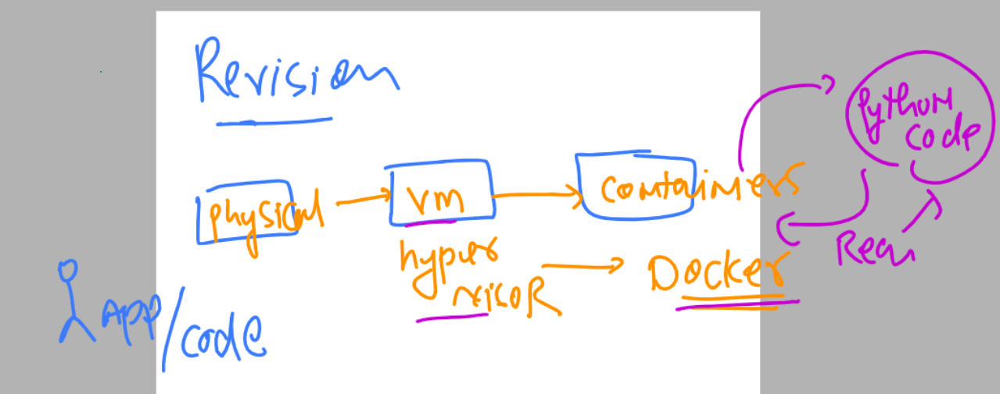
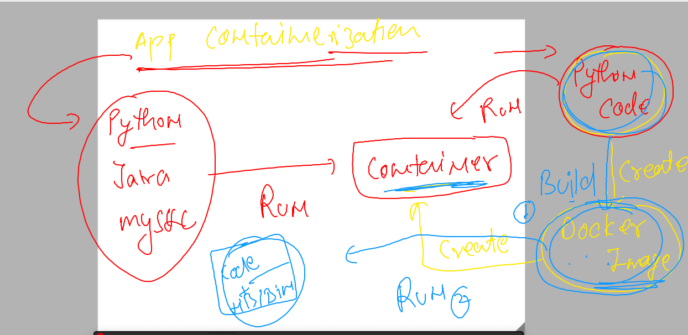
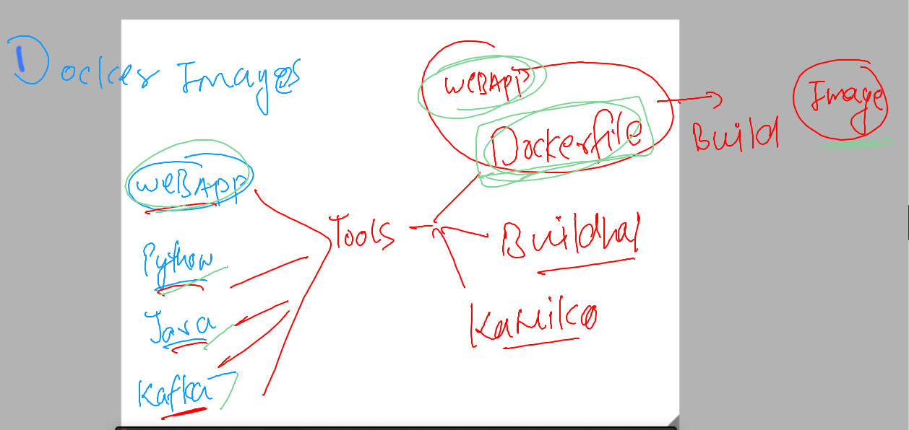

# k8s-cloud4c-b2

### Revision 



### App containerization 



### creating docker image using dockerfile tool 



### python sample code into docker image -- using Dockerfile 

### ashu.py as python sample code

```
import time

while True:
    print("Hello all , welcome to python..!!")
    time.sleep(3)
    print("Welcome to Cloud4C..")
    time.sleep(2)
    print("Welcome to Containers ..!!")
    print("______________________")
    time.sleep(3)
```

### Dockerfile 

```
FROM python
# we are refering to python lib/bin from docker officials
LABEL name=ashutoshh
LABEL email=ashutoshh@linux.com
# details of docker image creator -- optional 
RUN mkdir  /mycode 
COPY ashu.py  /mycode/ashu.py 
CMD ["python","/mycode/ashu.py"]
# use of CMD is to let docker know how to run code 
# while creating container from this image 
```

### building image using docker build 

```
[ec2-user@docker ashu-docker-images]$ ls
java-code  python-code  webapps
[ec2-user@docker ashu-docker-images]$ ls  python-code
ashu.py  Dockerfile
[ec2-user@docker ashu-docker-images]$ docker build  -t   ashupython:codev1   python-code/ 
Sending build context to Docker daemon  3.072kB
Step 1/6 : FROM python
 ---> 815c8c75dfc0
Step 2/6 : LABEL name=ashutoshh
 ---> Running in 33c5c0e399ae
Removing intermediate container 33c5c0e399ae
 ---> 9fbf119b8e2e
Step 3/6 : LABEL email=ashutoshh@linux.com
 ---> Running in bba76efe9e3b
Removing intermediate container bba76efe9e3b
 ---> 02d694069203
Step 4/6 : RUN mkdir  /mycode
 ---> Running in 9367e9610e72
Removing intermediate container 9367e9610e72
 ---> 978bacfb15a9
Step 5/6 : COPY ashu.py  /mycode/ashu.py
 ---> 2232902c2963
Step 6/6 : CMD ["python","/mycode/ashu.py"]
 ---> Running in 296331be3160
Removing intermediate container 296331be3160
 ---> 343f8464a8ed
Successfully built 343f8464a8ed
Successfully tagged ashupython:codev1
```

### lets check images

```
[ec2-user@docker ashu-docker-images]$ docker  images
REPOSITORY   TAG       IMAGE ID       CREATED          SIZE
ashupython   codev1    343f8464a8ed   47 seconds ago   920MB
akashneel    pyv1      cb28cb7c53ac   13 minutes ago   920MB
python       latest    815c8c75dfc0   2 weeks ago      920MB
```

