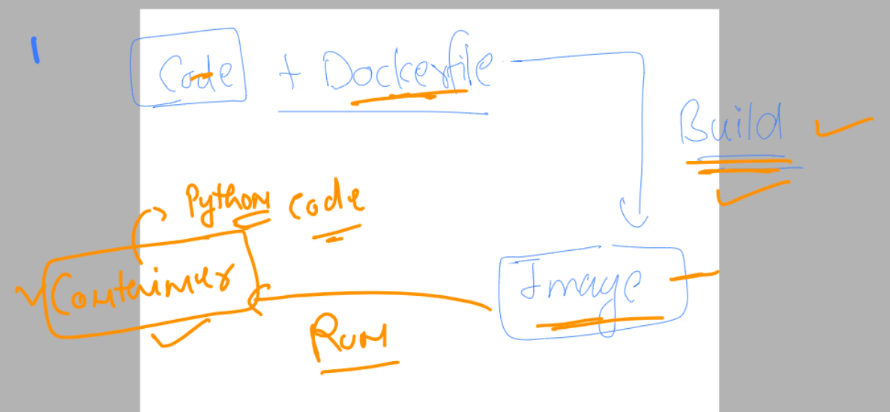

# k8s-cloud4c-b2

### Revision 


### App containerization 


### creating docker image using dockerfile tool 


### python sample code into docker image -- using Dockerfile 

### ashu.py as python sample code

```
import time

while True:
    print("Hello all , welcome to python..!!")
    time.sleep(3)
    print("Welcome to Cloud4C..")
    time.sleep(2)
    print("Welcome to Containers ..!!")
    print("______________________")
    time.sleep(3)
```

### Dockerfile 

```
FROM python
# we are refering to python lib/bin from docker officials
LABEL name=ashutoshh
LABEL email=ashutoshh@linux.com
# details of docker image creator -- optional 
RUN mkdir  /mycode 
COPY ashu.py  /mycode/ashu.py 
CMD ["python","/mycode/ashu.py"]
# use of CMD is to let docker know how to run code 
# while creating container from this image 
```

### building image using docker build 

```
[ec2-user@docker ashu-docker-images]$ ls
java-code  python-code  webapps
[ec2-user@docker ashu-docker-images]$ ls  python-code
ashu.py  Dockerfile
[ec2-user@docker ashu-docker-images]$ docker build  -t   ashupython:codev1   python-code/ 
Sending build context to Docker daemon  3.072kB
Step 1/6 : FROM python
 ---> 815c8c75dfc0
Step 2/6 : LABEL name=ashutoshh
 ---> Running in 33c5c0e399ae
Removing intermediate container 33c5c0e399ae
 ---> 9fbf119b8e2e
Step 3/6 : LABEL email=ashutoshh@linux.com
 ---> Running in bba76efe9e3b
Removing intermediate container bba76efe9e3b
 ---> 02d694069203
Step 4/6 : RUN mkdir  /mycode
 ---> Running in 9367e9610e72
Removing intermediate container 9367e9610e72
 ---> 978bacfb15a9
Step 5/6 : COPY ashu.py  /mycode/ashu.py
 ---> 2232902c2963
Step 6/6 : CMD ["python","/mycode/ashu.py"]
 ---> Running in 296331be3160
Removing intermediate container 296331be3160
 ---> 343f8464a8ed
Successfully built 343f8464a8ed
Successfully tagged ashupython:codev1
```

### lets check images

```
[ec2-user@docker ashu-docker-images]$ docker  images
REPOSITORY   TAG       IMAGE ID       CREATED          SIZE
ashupython   codev1    343f8464a8ed   47 seconds ago   920MB
akashneel    pyv1      cb28cb7c53ac   13 minutes ago   920MB
python       latest    815c8c75dfc0   2 weeks ago      920MB
```
### lets creating container using above created image



### creating container 

```
[ec2-user@docker ashu-docker-images]$ docker  run  --name ashuc1 -itd  ashupython:codev1 
38ccf9504767101954eaa0463ef31c106d3ebb6025cc8cfd96d4d2a8f2358d99

```

### checking container name 

```

[ec2-user@docker ashu-docker-images]$ docker  ps
CONTAINER ID   IMAGE               COMMAND                  CREATED         STATUS         PORTS     NAMES
38ccf9504767   ashupython:codev1   "python /mycode/ashu…"   5 seconds ago   Up 4 seconds             ashuc1
[ec2-user@docker ashu-docker-images]$ 
```

### checking output of python code in a running container 

```
[ec2-user@docker ashu-docker-images]$ docker   logs  ashuc1
Hello all , welcome to python..!!
Welcome to Cloud4C..
Welcome to Containers ..!!
______________________
Hello all , welcome to python
```

### docker container resources checking using docker stats

```
[ec2-user@docker ashu-docker-images]$ docker  stats ashuc1 
CONTAINER ID   NAME      CPU %     MEM USAGE / LIMIT     MEM %     NET I/O       BLOCK I/O   PIDS
38ccf9504767   ashuc1    0.01%     3.805MiB / 15.61GiB   0.02%     1.07kB / 0B   0B / 0B     1
```

### stopping a running container manually 

```
[ec2-user@docker ashu-docker-images]$ 
[ec2-user@docker ashu-docker-images]$ docker   stop  ashuc1
ashuc1
```
### starting the already existing container 

```
[ec2-user@docker ashu-docker-images]$ docker  start ashuc1
ashuc1
[ec2-user@docker ashu-docker-images]$ docker  ps
CONTAINER ID   IMAGE                COMMAND                  CREATED          STATUS          PORTS     NAMES
691fe492cd4a   siva:newv1           "python /mycode/siva…"   50 seconds ago   Up 48 seconds             sivaf1
d9ec0faa147a   raj:tag2             "python /mycode/raj.…"   11 minutes ago   Up 11 minutes             rajc3
1c1bd12d0a2d   phanipython:codev1   "python /mycode/kris…"   13 minutes ago   Up 13 minutes             krish1
8e9841ca7790   navinpython:codev1   "python /mycode/new_…"   14 minutes ago   Up 14 minutes             navcont1
0b3e3c376394   govind:codev1        "python3 /mycode/gov…"   15 minutes ago   Up 5 minutes              govind
48fda0ea5a84   akashneel:pyv1       "python /code/akashn…"   17 minutes ago   Up 17 minutes             akashneel1
3752e89d2556   hann:code            "python /mycode/Bobb…"   17 minutes ago   Up 17 minutes             dean
38ccf9504767   ashupython:codev1    "python /mycode/ashu…"   18 minutes ago   Up 1 second               ashuc1
```

### remove container forever 

```
[ec2-user@docker ashu-docker-images]$ docker  stop ashuc1
ashuc1
[ec2-user@docker ashu-docker-images]$ docker  rm  ashuc1
ashuc1
[ec2-user@docke
```


