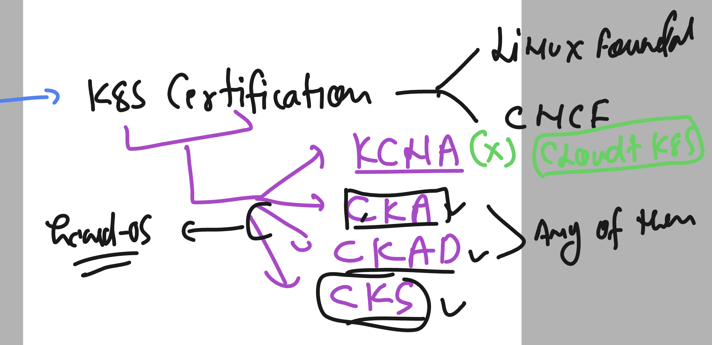

# k8s-cloud4c-b2

### Certification 



### creating service for wordpress pod 

```
[ec2-user@docker projec2]$ kubectl  get  po
NAME                      READY   STATUS    RESTARTS         AGE
ashu-db-959fd4977-d9zdx   1/1     Running   1 (41m ago)      23h
web-app-b57bf9d75-z4lsm   1/1     Running   11 (9m21s ago)   22h
[ec2-user@docker projec2]$ kubectl  get  svc
NAME        TYPE        CLUSTER-IP       EXTERNAL-IP   PORT(S)    AGE
ashulbdb1   ClusterIP   10.104.154.239   <none>        3306/TCP   23h
[ec2-user@docker projec2]$ kubectl  get  deploy 
NAME      READY   UP-TO-DATE   AVAILABLE   AGE
ashu-db   1/1     1            1           23h
web-app   1/1     1            1           22h
[ec2-user@docker projec2]$ kubectl  expose deployment web-app --type NodePort --port 80 --name lbweb --dry-run=client -o yaml >websvc.yaml 
[ec2-user@docker projec2]$ kubectl apply -f websvc.yaml 
service/lbweb created
[ec2-user@docker projec2]$ kubectl  get  svc
NAME        TYPE        CLUSTER-IP       EXTERNAL-IP   PORT(S)        AGE
ashulbdb1   ClusterIP   10.104.154.239   <none>        3306/TCP       23h
lbweb       NodePort    10.111.0.115     <none>        80:31361/TCP   3s
[ec2-user@docker projec2]$ 
```

