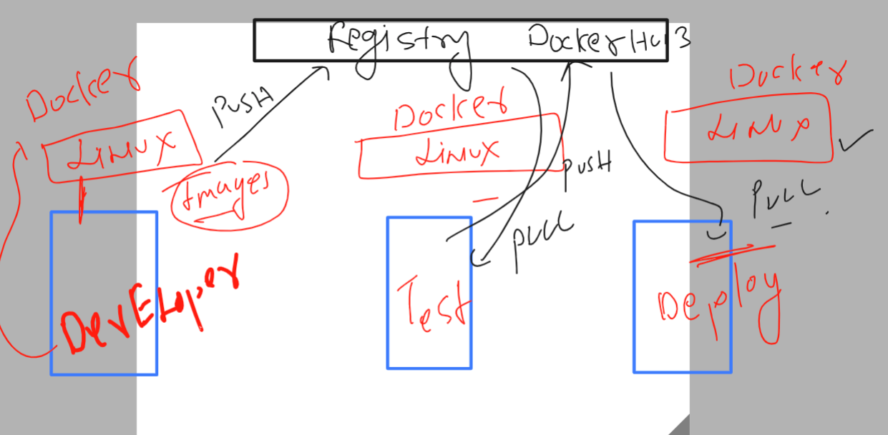

# k8s-cloud4c-b2

### Revision of Docker containers


### similar to docker 


### Dockerfile FROM is taking image from Docker hub 


### java code containerization 

### dockerfile 

```
FROM openjdk
LABEL name=ashutoshh
RUN mkdir /mydata
COPY ashu.java /mydata/ashu.java 
WORKDIR /mydata
# is to change directory like cd commnad 
# during docker image build time 
RUN javac  ashu.java 
# compiling code 
CMD ["java","ashu"]

```

### java code 

```
class ashu { 
    public static void main(String args[]) 
    { 
        // test expression 
        while (true) { 
            System.out.println("Hello World"); 
            try {
                Thread.sleep(2000);
            } catch (Exception ex) {
                // Ignored
            }
  
            // update expression 
        } 
    } 
} 
```

### lets build java image 

```
[ec2-user@docker ashu-docker-images]$ ls
java-code  python-code  webapps
[ec2-user@docker ashu-docker-images]$ ls  java-code/
ashu.java  Dockerfile
[ec2-user@docker ashu-docker-images]$ docker build -t ashujava:v1  java-code/
Sending build context to Docker daemon  3.072kB
Step 1/7 : FROM openjdk
 ---> 71260f256d19
Step 2/7 : LABEL name=ashutoshh
 ---> Running in 2b8daf0a5747
```

### test and remove 

```
[ec2-user@docker ashu-docker-images]$ docker  images   |  grep ashu
ashujava        v1             71e3c498a5d5   6 minutes ago        470MB
ashupython      codev1         343f8464a8ed   24 hours ago         920MB
[ec2-user@docker ashu-docker-images]$ 
[ec2-user@docker ashu-docker-images]$ docker  run -itd  --name ashujc1  ashujava:v1 
b718841df4272f8406012d7782976a8283d02e5bf83f1208799d077b34785f42
[ec2-user@docker ashu-docker-images]$ docker  ps
CONTAINER ID   IMAGE         COMMAND       CREATED         STATUS        PORTS     NAMES
b718841df427   ashujava:v1   "java ashu"   2 seconds ago   Up 1 second             ashujc1
[ec2-user@docker ashu-docker-images]$ docker logs ashujc1
Hello World
Hello World
Hello World
Hello World
Hello World
Hello World
[ec2-user@docker ashu-docker-images]$ docker  stop ashujc1
ashujc1
[ec2-user@docker ashu-docker-images]$ docker rm ashujc1 
ashujc1
[ec2-user@docker ashu-docker-images]$ 

```

## Understanding running a website inside container 

### Understanding website and web app servers


### web app server -- httpd vs nginx 


### downloading sample website code 

```
[ec2-user@docker ashu-docker-images]$ ls
java-code  python-code  webapps
[ec2-user@docker ashu-docker-images]$ 
[ec2-user@docker ashu-docker-images]$ git clone  https://github.com/schoolofdevops/html-sample-app.git
Cloning into 'html-sample-app'...
remote: Enumerating objects: 74, done.
remote: Counting objects: 100% (74/74), done.
remote: Compressing objects: 100% (69/69), done.
remote: Total 74 (delta 5), reused 72 (delta 5), pack-reused 0
Receiving objects: 100% (74/74), 1.38 MiB | 41.58 MiB/s, done.
Resolving deltas: 100% (5/5), done.
[ec2-user@docker ashu-docker-images]$ ls
html-sample-app  java-code  python-code  webapps
[ec2-user@docker ashu-docker-images]$ 

```
### creating Dockerfile 

```
FROM nginx
#  taking nginx webapp server image from docker hub 
LABEL email=ashutoshh@linux.com 
COPY .  /usr/share/nginx/html/
```

### .dockerignore file 

```
Dockerfile
LICENSE.txt
README.txt
.dockerignore
```
### building image 

```
[ec2-user@docker ashu-docker-images]$ ls
html-sample-app  java-code  python-code  webapps
[ec2-user@docker ashu-docker-images]$ docker  build  -t  ashuwebapp:v1   html-sample-app/
Sending build context to Docker daemon   3.61MB
Step 1/3 : FROM nginx
latest: Pulling from library/nginx
f03b40093957: Pull complete 
0972072e0e8a: Pull complete 
a85095acb896: Pull complete 
d24b987aa74e: Pull complete 
6c1a86118ade: Pull complete 
9989f7b33228: Pull complete 
Digest: sha256:f5747a42e3adcb3168049d63278d7251d91185bb5111d2563d58729a5c9179b0
Status: Downloaded newer image for nginx:latest
 ---> a7be6198544f
Step 2/3 : LABEL email=ashutoshh@linux.com
 ---> Running in 98edd0481d2e
Removing intermediate container 98edd0481d2e
 ---> f0da5b029fdf
Step 3/3 : COPY .  /usr/share/nginx/html/
 ---> 875763e874a1
Successfully built 875763e874a1
Successfully tagged ashuwebapp:v1
```

### checking my images

```
 69  docker  images 
   70  history 
[ec2-user@docker ashu-docker-images]$ docker  images   |  grep ashu
ashuwebapp      v1             875763e874a1   49 seconds ago   146MB
ashujava        v1             71e3c498a5d5   42 minutes ago   470MB
ashupython      codev1         343f8464a8ed   24 hours ago     920MB
```
### Understanding docker networking with port forwarding option 


####

```
[ec2-user@docker ashu-docker-images]$ docker  run -itd --name ashuwebsite1  -p  1234:80    ashuwebapp:v1 
e30719cbea8a5a49e4145302b8fa9a9ed9e6abebbab739f958c7e187bce4fd1d
[ec2-user@docker ashu-docker-images]$ docker ps
CONTAINER ID   IMAGE                    COMMAND                  CREATED          STATUS          PORTS                                   NAMES
e30719cbea8a   ashuwebapp:v1            "/docker-entrypoint.…"   14 seconds ago   Up 13 seconds   0.0.0.0:1234->80/tcp, :::1234->80/tcp   ashuwebsite1
f65b62ac40d1   venkawebapp:v1           "/docker-entrypoint.…"   8 minutes ago    Up 8 minutes    80/tcp                                  venkawebappcontainer
f717963a808b   ruchikajava:imagejava1   "java ruchika"           38 minutes ago   Up 37 minutes                                           ruchikajc1
5c67bd89cdfb   rajeshjava:v1            "java rajesh"            38 minutes ago   Up 38 minutes                                           rajeshjc1
0747f3b940f6   akashneeljava:v1         "java akashneel"         39 minutes ago   Up 39 minutes                                           akashneel2
0b2e7a57124f   asifjava:codev1          "java asif"              45 minutes ago   Up 45 minutes                                           asifjcon1
c921e1a45f15   siva:java                "java siva"              45 minutes ago   Up 45 minutes                                           sivacontainerjava1
[ec2-user@docker ashu-docker-images]$ 
```
### Introduction to docker hub -- image registry to share and store docker images




