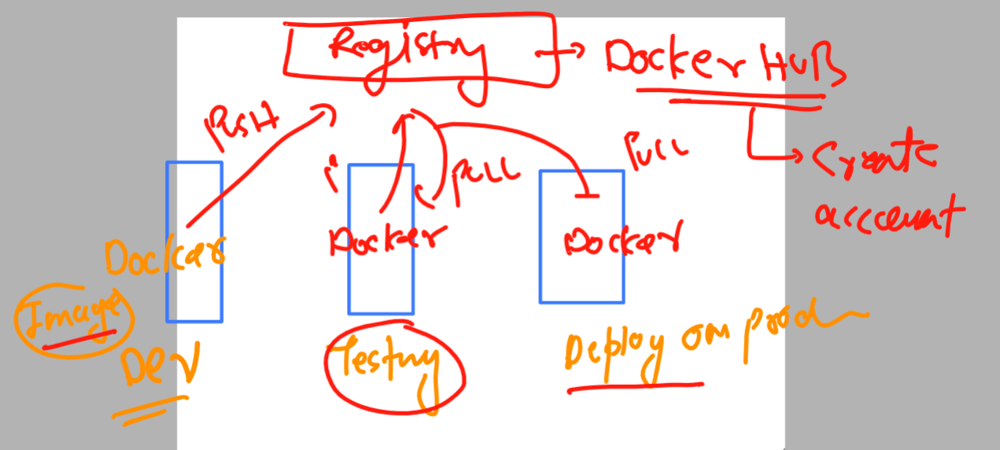
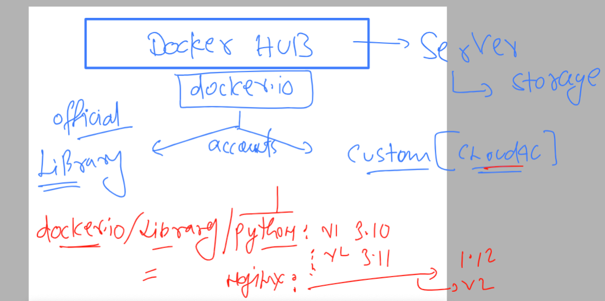

# k8s-cloud4c-b2

### Revision 


### understanding the use of docker hub -- store images



### understanding name of docker image in docker hub account 



## pushing image on docker hub registry 

### step 1 -- convert image name as per required format 

```
[ec2-user@docker ashu-docker-images]$ docker images  |  grep ashu
ashuwebapp         v1             875763e874a1   23 hours ago   146MB
ashujava           v1             71e3c498a5d5   24 hours ago   470MB
ashupython         codev1         343f8464a8ed   47 hours ago   920MB
[ec2-user@docker ashu-docker-images]$ 
[ec2-user@docker ashu-docker-images]$ 
[ec2-user@docker ashu-docker-images]$ docker  tag  ashuwebapp:v1   docker.io/dockerashu/ashuwebsite:v1 
[ec2-user@docker ashu-docker-images]$ 
[ec2-user@docker ashu-docker-images]$ docker images  |  grep ashu
dockerashu/ashuwebsite   v1             875763e874a1   23 hours ago   146MB
ashuwebapp               v1             875763e874a1   23 hours ago   146MB
ashujava                 v1             71e3c498a5d5   24 hours ago   470MB
ashupython               codev1         343f8464a8ed   47 hours ago   920MB
[ec2-user@docker ashu-docker-images]$ 


```

### login to docker hub from docker terminal 

```
[ec2-user@docker ashu-docker-images]$ docker login  
Login with your Docker ID to push and pull images from Docker Hub. If you don't have a Docker ID, head over to https://hub.docker.com to create one.
Username: dockerashu
Password: 
WARNING! Your password will be stored unencrypted in /home/ec2-user/.docker/config.json.
Configure a credential helper to remove this warning. See
https://docs.docker.com/engine/reference/commandline/login/#credentials-store

Login Succeeded
```

### push the image 

```
ec2-user@docker ashu-docker-images]$ docker push  docker.io/dockerashu/ashuwebsite:v1 
The push refers to repository [docker.io/dockerashu/ashuwebsite]
06c6edc3cac2: Pushed 
4d33db9fdf22: Mounted from library/nginx 
6791458b3942: Mounted from library/nginx 
2731b5cfb616: Mounted from library/nginx 
043198f57be0: Mounted from library/nginx 
```

