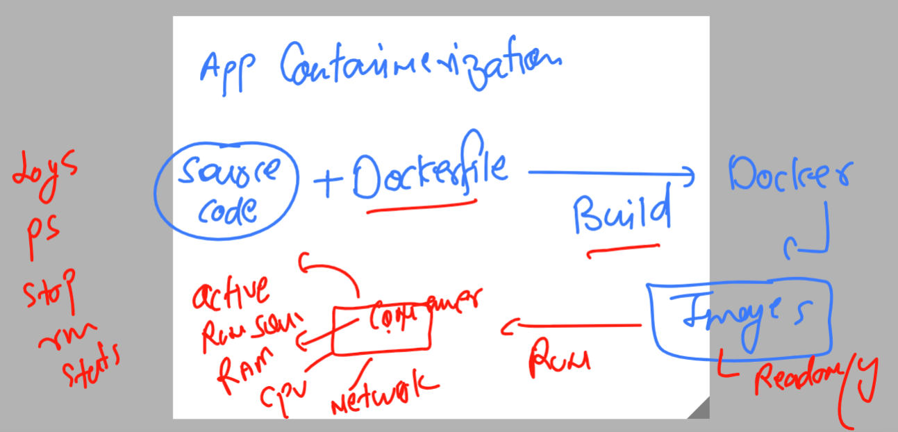

# k8s-cloud4c-b2

### Revision 



### understanding the use of docker hub -- store images


### understanding name of docker image in docker hub account 


## pushing image on docker hub registry 

### step 1 -- convert image name as per required format 

```
[ec2-user@docker ashu-docker-images]$ docker images  |  grep ashu
ashuwebapp         v1             875763e874a1   23 hours ago   146MB
ashujava           v1             71e3c498a5d5   24 hours ago   470MB
ashupython         codev1         343f8464a8ed   47 hours ago   920MB
[ec2-user@docker ashu-docker-images]$ 
[ec2-user@docker ashu-docker-images]$ 
[ec2-user@docker ashu-docker-images]$ docker  tag  ashuwebapp:v1   docker.io/dockerashu/ashuwebsite:v1 
[ec2-user@docker ashu-docker-images]$ 
[ec2-user@docker ashu-docker-images]$ docker images  |  grep ashu
dockerashu/ashuwebsite   v1             875763e874a1   23 hours ago   146MB
ashuwebapp               v1             875763e874a1   23 hours ago   146MB
ashujava                 v1             71e3c498a5d5   24 hours ago   470MB
ashupython               codev1         343f8464a8ed   47 hours ago   920MB
[ec2-user@docker ashu-docker-images]$ 


```

### login to docker hub from docker terminal 

```
[ec2-user@docker ashu-docker-images]$ docker login  
Login with your Docker ID to push and pull images from Docker Hub. If you don't have a Docker ID, head over to https://hub.docker.com to create one.
Username: dockerashu
Password: 
WARNING! Your password will be stored unencrypted in /home/ec2-user/.docker/config.json.
Configure a credential helper to remove this warning. See
https://docs.docker.com/engine/reference/commandline/login/#credentials-store

Login Succeeded
```

### push the image 

```
ec2-user@docker ashu-docker-images]$ docker push  docker.io/dockerashu/ashuwebsite:v1 
The push refers to repository [docker.io/dockerashu/ashuwebsite]
06c6edc3cac2: Pushed 
4d33db9fdf22: Mounted from library/nginx 
6791458b3942: Mounted from library/nginx 
2731b5cfb616: Mounted from library/nginx 
043198f57be0: Mounted from library/nginx 
```

### overall docker knowledge to start with kubernetes journey 


### Introduction to container management / orchestration platforms / technology 


### k8s info


### k8s arch1 


### k8s client side tools to connect k8s master 


### Installing kubectl in k8s client machine 

```
[ec2-user@docker ashu-docker-images]$    curl -LO "https://dl.k8s.io/release/$(curl -L -s https://dl.k8s.io/release/stable.txt)/bin/linux/amd64/kubectl"
  % Total    % Received % Xferd  Average Speed   Time    Time     Time  Current
                                 Dload  Upload   Total   Spent    Left  Speed
100   138  100   138    0     0   3463      0 --:--:-- --:--:-- --:--:--  3538
100 46.9M  100 46.9M    0     0  84.4M      0 --:--:-- --:--:-- --:--:-- 84.4M
[ec2-user@docker ashu-docker-images]$ ls
html-sample-app  java-code  kubectl  python-code  webapps
[ec2-user@docker ashu-docker-images]$ sudo mv  kubectl  /usr/bin/
[ec2-user@docker ashu-docker-images]$ sudo chmod +x /usr/bin/kubectl 
[ec2-user@docker ashu-docker-images]$ 

```

### verify installation 

```
[ec2-user@docker ashu-docker-images]$ kubectl version --client  -o yaml 
clientVersion:
  buildDate: "2023-05-17T14:20:07Z"
  compiler: gc
  gitCommit: 7f6f68fdabc4df88cfea2dcf9a19b2b830f1e647
  gitTreeState: clean
  gitVersion: v1.27.2
  goVersion: go1.20.4
  major: "1"
  minor: "27"
  platform: linux/amd64
kustomizeVersion: v5.0.1
```

### checking from windows also 

```
PS C:\Users\hp\Downloads> .\kubectl.exe  version --client -o json
{
  "clientVersion": {
    "major": "1",
    "minor": "27",
    "gitVersion": "v1.27.2",
    "gitCommit": "7f6f68fdabc4df88cfea2dcf9a19b2b830f1e647",
    "gitTreeState": "clean",
    "buildDate": "2023-05-17T14:20:07Z",
    "goVersion": "go1.20.4",
    "compiler": "gc",
    "platform": "windows/amd64"
  },
  "kustomizeVersion": "v5.0.1"
```

### Understanding kube-apiserver in control plane 


### in control plane server -- auth file is listed 

```
[root@ip-172-31-23-211 ~]# cd  /etc/kubernetes/
[root@ip-172-31-23-211 kubernetes]# ls
admin.conf
```
### download file in k8s client machine 

```
[ec2-user@docker ashu-docker-images]$ whoami
ec2-user
[ec2-user@docker ashu-docker-images]$ 
[ec2-user@docker ashu-docker-images]$ mkdir  ~/.kube 
[ec2-user@docker ashu-docker-images]$ 
[ec2-user@docker ashu-docker-images]$ cd ~/.kube/
[ec2-user@docker .kube]$ 
[ec2-user@docker .kube]$ wget  http://44.214.166.246/admin.conf 
--2023-05-25 13:08:53--  http://44.214.166.246/admin.conf
Connecting to 44.214.166.246:80... connected.
HTTP request sent, awaiting response... 200 OK
Length: 5641 (5.5K) [text/plain]
Saving to: ‘admin.conf’

100%[===================================================================>] 5,641       --.-K/s   in 0s      

2023-05-25 13:08:53 (527 MB/s) - ‘admin.conf’ saved [5641/5641]

[ec2-user@docker .kube]$ ls
admin.conf
[ec2-user@docker .kube]$ mv admin.conf config 
[ec2-user@docker .kube]$ ls
config
[ec2-user@docker .kube]$ 
```

### lets verify 

```
[ec2-user@docker ashu-docker-images]$ kubectl  get  nodes
NAME                            STATUS   ROLES           AGE     VERSION
ip-172-31-18-85.ec2.internal    Ready    <none>          4d11h   v1.26.5
ip-172-31-23-211.ec2.internal   Ready    control-plane   4d11h   v1.26.5
ip-172-31-23-254.ec2.internal   Ready    <none>          4d11h   v1.26.5
ip-172-31-27-200.ec2.internal   Ready    <none>          4d11h   v1.26.5
ip-172-31-29-164.ec2.internal   Ready    <none>          4d11h   v1.26.5
[ec2-user@docker ashu-docker-images]$ 
```
### verify again 

```
[ec2-user@docker ashu-docker-images]$ kubectl  cluster-info 
Kubernetes control plane is running at https://172.31.23.211:6443
CoreDNS is running at https://172.31.23.211:6443/api/v1/namespaces/kube-system/services/kube-dns:dns/proxy

To further debug and diagnose clus
```

### more option

```
[ec2-user@docker ashu-docker-images]$ kubectl version -o yaml
clientVersion:
  buildDate: "2023-05-17T14:20:07Z"
  compiler: gc
  gitCommit: 7f6f68fdabc4df88cfea2dcf9a19b2b830f1e647
  gitTreeState: clean
  gitVersion: v1.27.2
  goVersion: go1.20.4
  major: "1"
  minor: "27"
  platform: linux/amd64
kustomizeVersion: v5.0.1
serverVersion:
  buildDate: "2023-05-17T14:08:49Z"
  compiler: gc
  gitCommit: 890a139214b4de1f01543d15003b5bda71aae9c7
  gitTreeState: clean
  gitVersion: v1.26.5
  goVersion: go1.19.9
  major: "1"
  minor: "26"
  platform: linux/amd64
```
