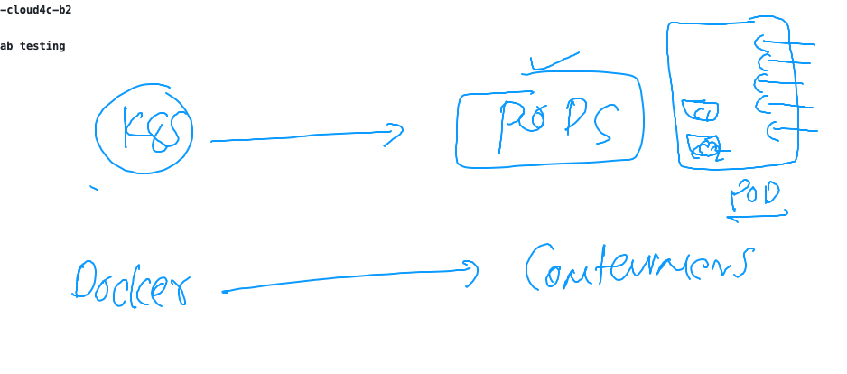
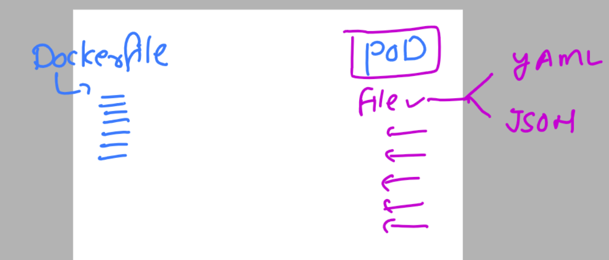

# k8s-cloud4c-b2

### introduction to pod in k8s env 



### creating pod env using a file in YAML | JSON 



### first pod yaml file 

```
apiVersion: v1 # we are targeting to master server api 
kind: Pod  # i want to target about POd 
metadata:
  name: ashu-webapp-pod # name of my POD 
spec:
  containers:
  - name: ashuc1
    image: dockerashu/ashuwebsite:v1 # image from docker hub 
    ports: # optional part by default my web port number 
    - containerPort: 80 
    
```

### lets create 

```
[ec2-user@docker ashu-docker-images]$ ls
ashu-k8s-appdeploy  html-sample-app  java-code  python-code  webapps
[ec2-user@docker ashu-docker-images]$ cd ashu-k8s-appdeploy/
[ec2-user@docker ashu-k8s-appdeploy]$ ls
ashu-pod1.yaml
[ec2-user@docker ashu-k8s-appdeploy]$ kubectl  create  -f  ashu-pod1.yaml 
pod/ashu-webapp-pod created
[ec2-user@docker ashu-k8s-appdeploy]$ kubectl  get  pods
NAME              READY   STATUS             RESTARTS   AGE
ashu-webapp-pod   1/1     Running            0          7s
deanpod           0/1     ImagePullBackOff   0          7m13s
[ec2-user@docker ashu-k8s-appdeploy]$

```

### delete and create 

```
[ec2-user@docker ashu-k8s-appdeploy]$ kubectl delete -f ashu-pod1.yaml 
pod "ashu-webapp-pod" deleted
[ec2-user@docker ashu-k8s-appdeploy]$ kubectl create -f ashu-pod1.yaml 
pod/ashu-webapp-pod created
[ec2-user@docker ashu-k8s-appdeploy]$ kubectl  get  pods
NAME                   READY   STATUS             RESTARTS   AGE
akashneel-webapp-pod   1/1     Running            0          17m
ashu-webapp-pod        1/1     Running            0          14s
asif-webapp-pod        1/1     Running            0          21m
```

### introduction to schedular in k8s 


### checking pod schedule 

```
[ec2-user@docker ashu-k8s-appdeploy]$ kubectl  get  nodes 
NAME                            STATUS   ROLES           AGE   VERSION
ip-172-31-18-85.ec2.internal    Ready    <none>          8d    v1.26.5
ip-172-31-23-211.ec2.internal   Ready    control-plane   8d    v1.26.5
ip-172-31-23-254.ec2.internal   Ready    <none>          8d    v1.26.5
ip-172-31-27-200.ec2.internal   Ready    <none>          8d    v1.26.5
ip-172-31-29-164.ec2.internal   Ready    <none>          8d    v1.26.5
[ec2-user@docker ashu-k8s-appdeploy]$ kubectl  get  pod
NAME                   READY   STATUS             RESTARTS   AGE
akashneel-webapp-pod   1/1     Running            0          23m
ashu-webapp-pod        1/1     Running            0          6m56s
asif-webapp-pod        1/1     Running            0          28m
deanpod                1/1     Running            0          6m11s
govind-webapp1-pod     0/1     ImagePullBackOff   0          10m
govind-webapp2-pod     1/1     Running            0          7m8s
navi-webapp-pod        1/1     Running            0          26m
phani-webapp-pod       1/1     Running            0          5m1s
rajesh-webapp-pod      1/1     Running            0          6m34s
ruchika-webapp-pod     1/1     Running            0          19m
sampod                 1/1     Running            0          21m
siva-webapp-pod1       1/1     Running            0          22m
venkat-webapp-pod1     1/1     Running            0          9m19s
[ec2-user@docker ashu-k8s-appdeploy]$ kubectl  get  pod  ashu-webapp-pod  -o wide 
NAME              READY   STATUS    RESTARTS   AGE    IP              NODE                            NOMINATED NODE   READINESS GATES
ashu-webapp-pod   1/1     Running   0          7m3s   192.168.161.5   ip-172-31-23-254.ec2.internal   <none>           <none>
[ec2-user@docker ashu-k8s-appdeploy]$ 
```

### taking all pod details 

```
[ec2-user@docker ashu-k8s-appdeploy]$ kubectl  get  pod -o wide
NAME                   READY   STATUS    RESTARTS   AGE     IP                NODE                            NOMINATED NODE   READINESS GATES
akashneel-webapp-pod   1/1     Running   0          27m     192.168.109.66    ip-172-31-27-200.ec2.internal   <none>           <none>
ashu-webapp-pod        1/1     Running   0          10m     192.168.161.5     ip-172-31-23-254.ec2.internal   <none>           <none>
asif-webapp-pod        1/1     Running   0          31m     192.168.255.65    ip-172-31-18-85.ec2.internal    <none>           <none>
deanpod                1/1     Running   0          9m55s   192.168.255.69    ip-172-31-18-85.ec2.internal    <none>           <none>
```

### checking logs of pod container 

```
ec2-user@docker ashu-k8s-appdeploy]$ kubectl   logs  ashu-webapp-pod 
/docker-entrypoint.sh: /docker-entrypoint.d/ is not empty, will attempt to perform configuration
/docker-entrypoint.sh: Looking for shell scripts in /docker-entrypoint.d/
/docker-entrypoint.sh: Launching /docker-entrypoint.d/10-listen-on-ipv6-by-default.sh
10-listen-on-ipv6-by-default.sh: info: Getting the checksum of /etc/nginx/conf.d/default.conf
10-listen-on-ipv6-by-default.sh: info: Enabled listen on IPv6 in /etc/nginx/conf.d/default.conf
/docker-entrypoint.sh: Launching /docker-entrypoint.d/20-envsubst-on-templates.sh
/docker-entrypoint.sh: Launching /docker-entrypoint.d/30-tune-worker-processes.sh
/docker-entrypoint.sh: Configuration complete; ready for start up
2023/05/29 12:40:49 [notice] 1#1: using the "epoll" event method
2023/05/29 12:40:49 [notice] 1#1: nginx/1.23.4

```

### accessing shell of container running inside pod

```
[ec2-user@docker ashu-k8s-appdeploy]$ kubectl   exec  -it  ashu-webapp-pod  -- bash
root@ashu-webapp-pod:/# 
root@ashu-webapp-pod:/# id
uid=0(root) gid=0(root) groups=0(root)
root@ashu-webapp-pod:/# ls 
bin  boot  dev  docker-entrypoint.d  docker-entrypoint.sh  etc  home  lib  lib64  media  mnt  opt  proc  root  run  sbin  srv  sys  tmp  usr  var
root@ashu-webapp-pod:/# mkdir hello
root@ashu-webapp-pod:/# ls
bin  boot  dev  docker-entrypoint.d  docker-entrypoint.sh  etc  hello  home  lib  lib64  media  mnt  opt  proc  root  run  sbin  srv  sys  tmp  usr  var
root@ashu-webapp-pod:/# exit
exit
```
### deleting pod 

```
[ec2-user@docker ashu-k8s-appdeploy]$ kubectl delete pod ashu-webapp-pod  
pod "ashu-webapp-pod" deleted
```

### generating yaml / json for kubernetes 

```
ec2-user@docker ashu-k8s-appdeploy]$ kubectl  run  ashupod1  --image=nginx  --port 80  --dry-run=client -o yaml
apiVersion: v1
kind: Pod
metadata:
  creationTimestamp: null
  labels:
    run: ashupod1
  name: ashupod1
spec:
  containers:
  - image: nginx
    name: ashupod1
    ports:
    - containerPort: 80
    resources: {}
  dnsPolicy: ClusterFirst
  restartPolicy: Always
status: {}
[ec2-user@docker ashu-k8s-appdeploy]$ kubectl  run  ashupod1  --image=nginx  --port 80  --dry-run=client -o json 
{
    "kind": "Pod",
    "apiVersion": "v1",
    "metadata": {
        "name": "ashupod1",
        "creationTimestamp": null,
```

### file 

```
[ec2-user@docker ashu-k8s-appdeploy]$ kubectl  run  ashupod1  --image=nginx  --port 80  --dry-run=client -o yaml  >autopod.yaml
[ec2-user@docker ashu-k8s-appdeploy]$ 
[ec2-user@docker ashu-k8s-appdeploy]$ kubectl  run  ashupod1  --image=nginx  --port 80  --dry-run=client -o json >ashupodnew.json 
[ec2-user@docker ashu-k8s-appdeploy]$ 
[ec2-user@docker ashu-k8s-appdeploy]$ 
```

