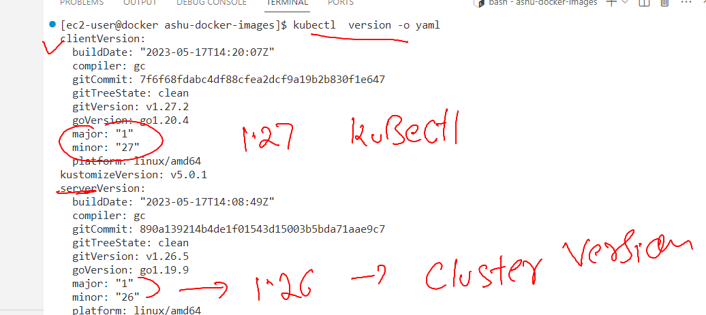
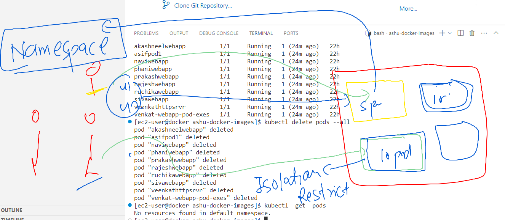

# k8s-cloud4c-b2

### checking k8s version 



### Introduction to Namespace in k8s 


## listing and creating namespace in k8s 

```
[ec2-user@docker ashu-docker-images]$ kubectl   get  pods
No resources found in default namespace.
[ec2-user@docker ashu-docker-images]$ kubectl    get   namespaces 
NAME              STATUS   AGE
default           Active   9d
kube-node-lease   Active   9d
kube-public       Active   9d
kube-system       Active   9d
[ec2-user@docker ashu-docker-images]$ kubectl   create   namespace  ashu-space 
namespace/ashu-space created
[ec2-user@docker ashu-docker-images]$ kubectl    get   namespaces 
NAME              STATUS   AGE
ashu-space        Active   3s
default           Active   9d
kube-node-lease   Active   9d
kube-public       Active   9d
kube-system       Active   9d
[ec2-user@docker ashu-docker-images]$ kubectl config  set-context --current --namespace=ashu-space 
Context "kubernetes-admin@kubernetes" modified.
[ec2-user@docker ashu-docker-images]$ kubectl  get  pods
No resources found in ashu-space namespace.
```

### creating new pod yaml file 
```
 kubectl  run  ashunewpod --image=nginx --port 80 --dry-run=client -o yaml  >mypod.yaml 
[ec2-user@docker ashu-k8s-appdeploy]$ ls
ashu-pod1.yaml  ashupodnew.json  autopod.yaml  mypod.yaml
```

### creating pod 

```
[ec2-user@docker ashu-k8s-appdeploy]$ ls
ashu-pod1.yaml  ashupodnew.json  autopod.yaml  mypod.yaml
[ec2-user@docker ashu-k8s-appdeploy]$ kubectl  create  -f mypod.yaml 
pod/ashunewpod created
[ec2-user@docker ashu-k8s-appdeploy]$ kubectl get  pod
NAME         READY   STATUS    RESTARTS   AGE
ashunewpod   1/1     Running   0          4s
[ec2-user@docker ashu-k8s-appdeploy]$ 

```


