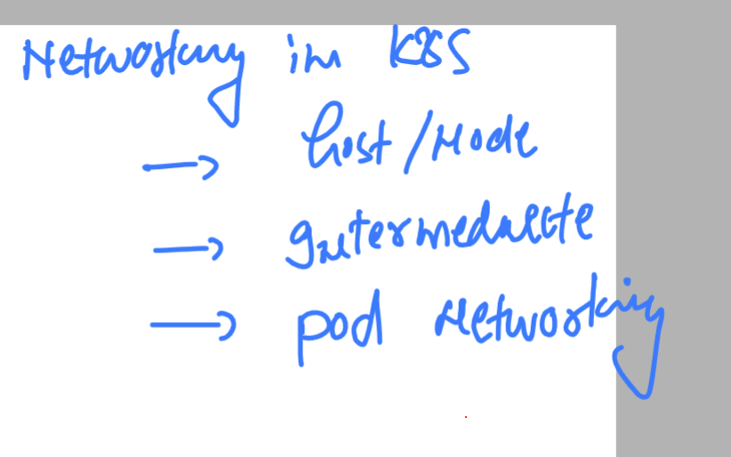
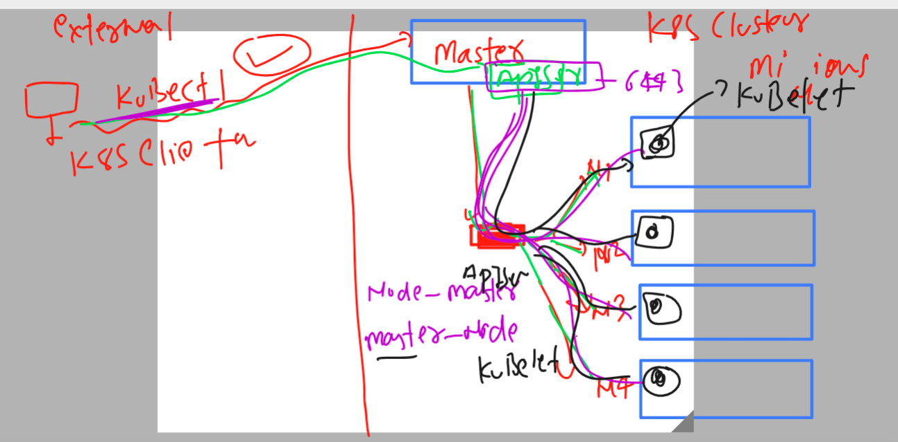
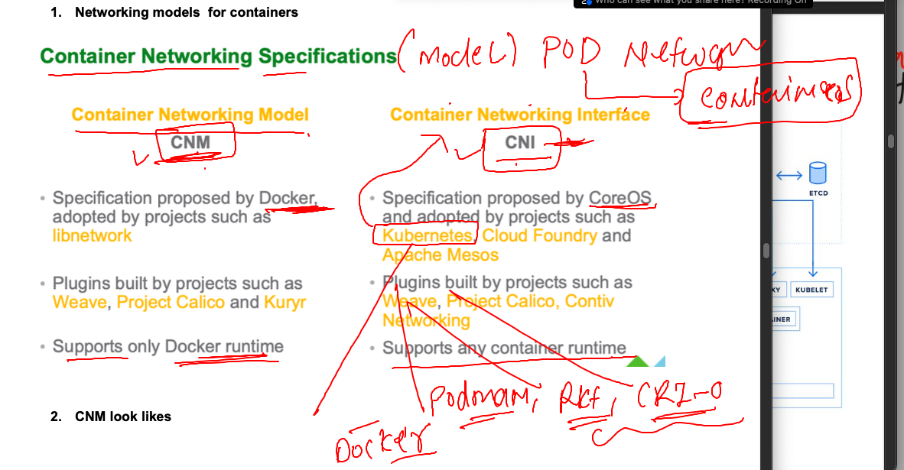
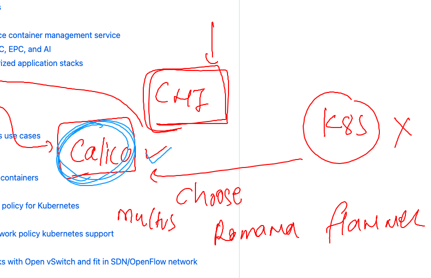
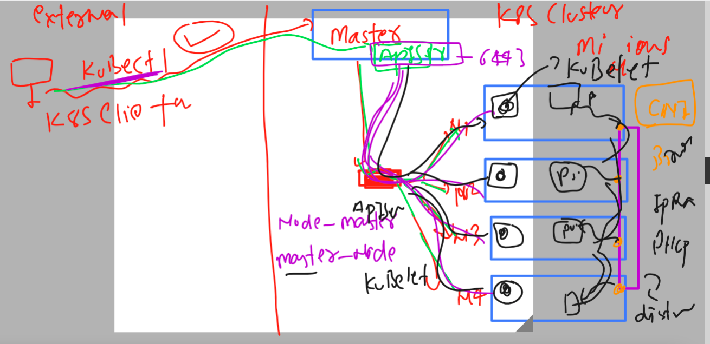

# k8s-cloud4c-b2

### checking k8s version 


### Introduction to Namespace in k8s 


## listing and creating namespace in k8s 

```
[ec2-user@docker ashu-docker-images]$ kubectl   get  pods
No resources found in default namespace.
[ec2-user@docker ashu-docker-images]$ kubectl    get   namespaces 
NAME              STATUS   AGE
default           Active   9d
kube-node-lease   Active   9d
kube-public       Active   9d
kube-system       Active   9d
[ec2-user@docker ashu-docker-images]$ kubectl   create   namespace  ashu-space 
namespace/ashu-space created
[ec2-user@docker ashu-docker-images]$ kubectl    get   namespaces 
NAME              STATUS   AGE
ashu-space        Active   3s
default           Active   9d
kube-node-lease   Active   9d
kube-public       Active   9d
kube-system       Active   9d
[ec2-user@docker ashu-docker-images]$ kubectl config  set-context --current --namespace=ashu-space 
Context "kubernetes-admin@kubernetes" modified.
[ec2-user@docker ashu-docker-images]$ kubectl  get  pods
No resources found in ashu-space namespace.
```

### creating new pod yaml file 
```
 kubectl  run  ashunewpod --image=nginx --port 80 --dry-run=client -o yaml  >mypod.yaml 
[ec2-user@docker ashu-k8s-appdeploy]$ ls
ashu-pod1.yaml  ashupodnew.json  autopod.yaml  mypod.yaml
```

### creating pod 

```
[ec2-user@docker ashu-k8s-appdeploy]$ ls
ashu-pod1.yaml  ashupodnew.json  autopod.yaml  mypod.yaml
[ec2-user@docker ashu-k8s-appdeploy]$ kubectl  create  -f mypod.yaml 
pod/ashunewpod created
[ec2-user@docker ashu-k8s-appdeploy]$ kubectl get  pod
NAME         READY   STATUS    RESTARTS   AGE
ashunewpod   1/1     Running   0          4s
[ec2-user@docker ashu-k8s-appdeploy]$ 

```
## Networking 

### there 3 level of networking we have to understand 



### master to node/ minion and node / master 



### k8s has adopted CNI over CNM network model 



### How to implement CNI --- Using calico Plugin 



### due to distributed NEtwork bridge by CNI -- pods are able to connect with each other by default 



### testing pod commnication 

```
[ec2-user@docker ashu-k8s-appdeploy]$ kubectl  get  pods -o wide 
NAME         READY   STATUS    RESTARTS   AGE   IP                NODE                            NOMINATED NODE   READINESS GATES
ashunewpod   1/1     Running   0          24m   192.168.151.141   ip-172-31-29-164.ec2.internal   <none>           <none>
[ec2-user@docker ashu-k8s-appdeploy]$ 
[ec2-user@docker ashu-k8s-appdeploy]$ kubectl   exec  -it  ashunewpod  --  bash 
root@ashunewpod:/# 
root@ashunewpod:/# curl http://192.168.151.142 
<!DOCTYPE html>
<html>
<head>
<title>Welcome to nginx!</title>
<style>
html { color-scheme: light dark; }
body { width: 35em; margin: 0 auto;
font-family: Tahoma, Verdana, Arial, sans-serif; }
</style>
</head>
<body>
```


