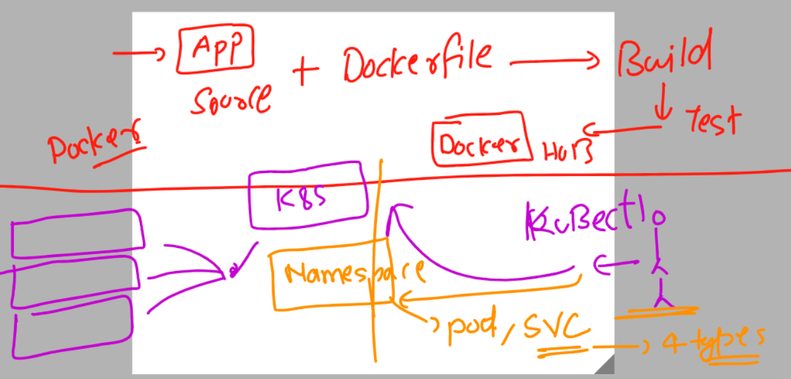
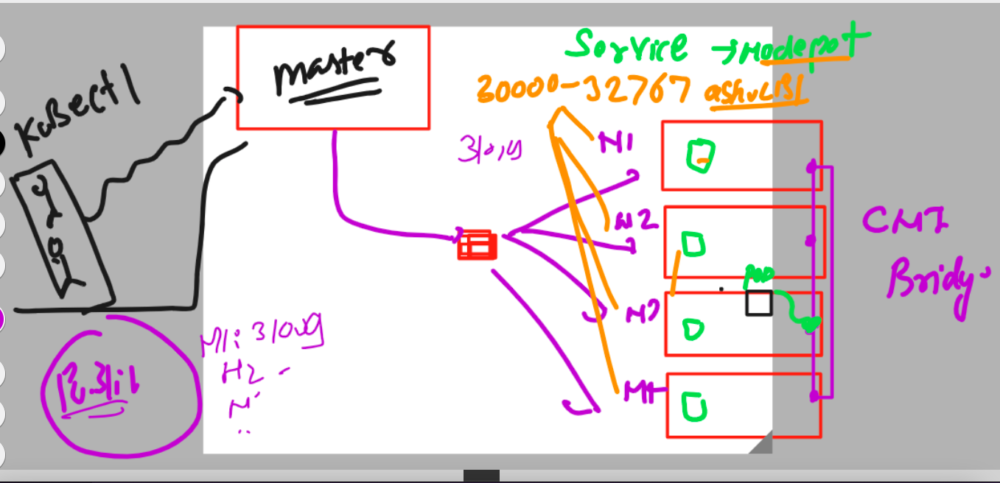
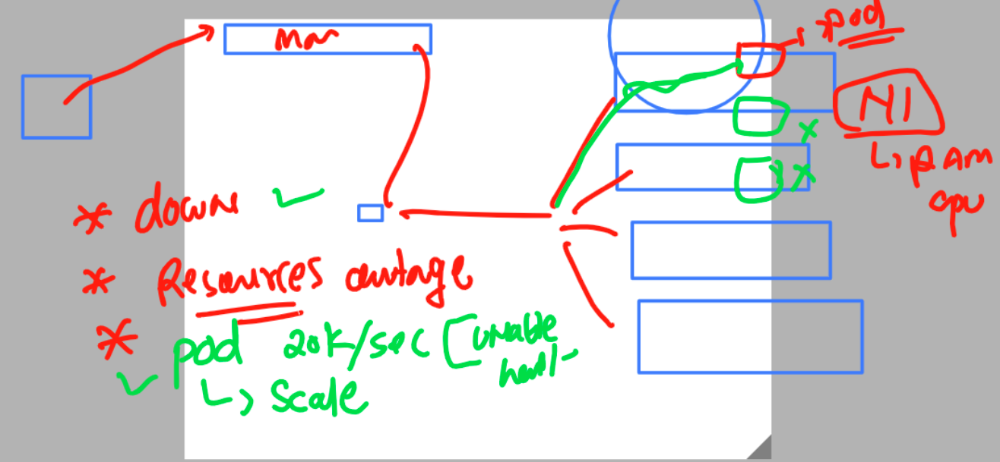
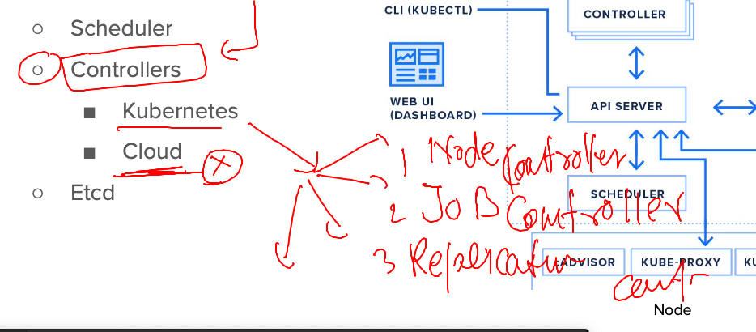
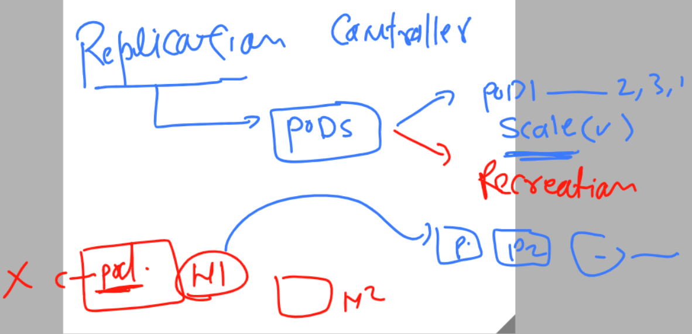

# k8s-cloud4c-b2

### Rev 



### lab connection 

```
[ec2-user@docker ashu-docker-images]$ kubectl  config get-contexts 
CURRENT   NAME                          CLUSTER      AUTHINFO           NAMESPACE
*         kubernetes-admin@kubernetes   kubernetes   kubernetes-admin   ashu-space
[ec2-user@docker ashu-docker-images]$ 
[ec2-user@docker ashu-docker-images]$ kubectl  get  pods
NAME         READY   STATUS    RESTARTS      AGE
ashunewpod   1/1     Running   1 (31m ago)   23h
[ec2-user@docker ashu-docker-images]$ kubectl  get  svc
NAME      TYPE       CLUSTER-IP      EXTERNAL-IP   PORT(S)        AGE
ashulb1   NodePort   10.107.24.185   <none>        80:30025/TCP   22h
[ec2-user@docker ashu-docker-images]$ 

```

### creating a pod yaml to deploy 

```
[ec2-user@docker ashu-docker-images]$ cd  ashu-k8s-appdeploy/
[ec2-user@docker ashu-k8s-appdeploy]$ ls
ashu-pod1.yaml  ashupodnew.json  autopod.yaml  mypod.yaml  nodeport.yaml
[ec2-user@docker ashu-k8s-appdeploy]$ kubectl  run ashu-webpod1 --image=dockerashu/summer:web4  --port 80 --dry-run=client -o yaml >day7pod.yaml 
```

### deploy webapp 

```
[ec2-user@docker ashu-k8s-appdeploy]$ ls
ashu-pod1.yaml  ashupodnew.json  autopod.yaml  day7pod.yaml  mypod.yaml  nodeport.yaml
[ec2-user@docker ashu-k8s-appdeploy]$ kubectl  create  -f day7pod.yaml 
pod/ashu-webpod1 created
[ec2-user@docker ashu-k8s-appdeploy]$ kubectl  get po 
NAME           READY   STATUS    RESTARTS   AGE
ashu-webpod1   1/1     Running   0          8s
[ec2-user@docker ashu-k8s-appdeploy]$ kubectl  get po -o wide
NAME           READY   STATUS    RESTARTS   AGE   IP               NODE                            NOMINATED NODE   READINESS GATES
ashu-webpod1   1/1     Running   0          11s   192.168.109.79   ip-172-31-27-200.ec2.internal   <none>           <none>
[ec2-user@docker ashu-k8s-appdeploy]$ 

```

### Understanding nodeport service in k8s 



### creating nodeport servcie 

```
ec2-user@docker ashu-k8s-appdeploy]$ kubectl   get  pods
NAME           READY   STATUS    RESTARTS   AGE
ashu-webpod1   1/1     Running   0          8m35s
[ec2-user@docker ashu-k8s-appdeploy]$ 
```

### 

```
[ec2-user@docker ashu-k8s-appdeploy]$ kubectl   expose  pod ashu-webpod1  --type NodePort --port 80 --name ashulb1 --dry-run=client -o yaml >day7nodeport.yaml 
[ec2-user@docker ashu-k8s-appdeploy]$ kubectl  create -f  day7nodeport.yaml 
service/ashulb1 created
[ec2-user@docker ashu-k8s-appdeploy]$ kubectl  get  svc
NAME      TYPE       CLUSTER-IP      EXTERNAL-IP   PORT(S)        AGE
ashulb1   NodePort   10.99.217.160   <none>        80:31152/TCP   5s
[ec2-user@docker ashu-k8s-appdeploy]$ 

```

### Deleting everything in your personal namespace 

```
ec2-user@docker ashu-k8s-appdeploy]$ kubectl   delete  all --all
pod "ashu-webpod1" deleted
service "ashulb1" deleted
[ec2-user@docker ashu-k8s-appdeploy]$ 

```

### creating service without expose option 

```
[ec2-user@docker ashu-k8s-appdeploy]$ kubectl   create  service 
Create a service using a specified subcommand.

Aliases:
service, svc

Available Commands:
  clusterip      Create a ClusterIP service
  externalname   Create an ExternalName service
  loadbalancer   Create a LoadBalancer service
  nodeport       Create a NodePort service

Usage:
  kubectl create service [flags] [options]

Use "kubectl <command> --help" for more information about a given command.
Use "kubectl options" for a list of global command-line options (applies to all commands).
[ec2-user@docker ashu-k8s-appdeploy]$ kubectl   create  service  loadbalancer  ashulb2 --tcp 1234:80  --dry-run=client -o yaml 
apiVersion: v1
kind: Service
metadata:
  creationTimestamp: null
  labels:
    app: ashulb2
```

### mytaskday7.yaml is having 

```
apiVersion: v1
kind: Pod
metadata:
  creationTimestamp: null
  labels:
    run: ashupod
  name: ashupod
spec:
  containers:
  - image: dockerashu/summer:web4
    name: ashupod
    ports:
    - containerPort: 80
    resources: {}
  dnsPolicy: ClusterFirst
  restartPolicy: Always
status: {}

---

apiVersion: v1
kind: Service
metadata:
  creationTimestamp: null
  labels:
    app: ashulb2
  name: ashulb2
spec:
  ports:
  - name: 1234-80
    port: 1234
    protocol: TCP
    targetPort: 80
  selector:
    app: ashulb2
  type: LoadBalancer
status:
  loadBalancer: {}
```

### lets do it now 

```
[ec2-user@docker ashu-k8s-appdeploy]$ kubectl  create -f  taskday7.yaml 
pod/ashupod created
service/ashulb2 created
[ec2-user@docker ashu-k8s-appdeploy]$ kubectl  get  pods
NAME      READY   STATUS    RESTARTS   AGE
ashupod   1/1     Running   0          9s
[ec2-user@docker ashu-k8s-appdeploy]$ kubectl  get  svc
NAME      TYPE           CLUSTER-IP       EXTERNAL-IP   PORT(S)          AGE
ashulb2   LoadBalancer   10.107.177.154   <pending>     1234:30629/TCP   12s
[ec2-user@docker ashu-k8s-appdeploy]$ 
```

### problem with current state 



### there are few controllers in k8s 



### Replication controller 




