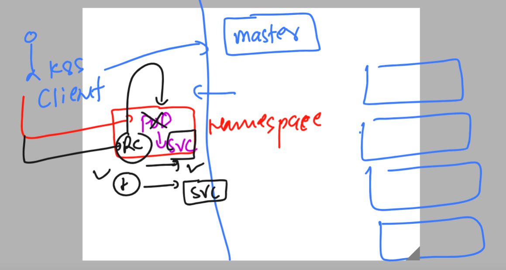

# k8s-cloud4c-b2

### testing lab env connection 

```
[ec2-user@docker ashu-docker-images]$ kubectl  config get-contexts 
CURRENT   NAME                          CLUSTER      AUTHINFO           NAMESPACE
*         kubernetes-admin@kubernetes   kubernetes   kubernetes-admin   ashu-space
[ec2-user@docker ashu-docker-images]$ 
[ec2-user@docker ashu-docker-images]$ 
[ec2-user@docker ashu-docker-images]$ kubectl  get  pods
No resources found in ashu-space namespace.
[ec2-user@docker ashu-docker-images]$ kubectl  get  svc
```

### Exploring RC again by Understanding 



### YAML of RC 

```
apiVersion: v1 
kind: ReplicationController 
metadata:
  name: ashu-app-rc # name of replication controller 
spec: 
  replicas: 1 # number of pods we want to be created 
  template: # for giving pod template information 
    metadata:
      labels: # label of pod which will be used by service to find 
        x: helloashu # key & value  x and helloashu 
    spec:
      containers:
      - image: dockerashu/ashuwebsite:v1
        name: ashuc1
        ports:
        - containerPort: 80 

```

### lets create it 

```
ec2-user@docker ashu-docker-images]$ ls
ashu-k8s-appdeploy  html-sample-app  java-code  python-code  webapps
[ec2-user@docker ashu-docker-images]$ cd  ashu-k8s-appdeploy/
[ec2-user@docker ashu-k8s-appdeploy]$ ls
ashu-pod1.yaml   ashu-webapp-rc.yaml  day7nodeport.yaml  mypod.yaml     taskday7.yaml
ashupodnew.json  autopod.yaml         day7pod.yaml       nodeport.yaml
[ec2-user@docker ashu-k8s-appdeploy]$ kubectl  create  -f  ashu-webapp-rc.yaml 
replicationcontroller/ashu-app-rc created
[ec2-user@docker ashu-k8s-appdeploy]$ kubectl   get   rc 
NAME          DESIRED   CURRENT   READY   AGE
ashu-app-rc   1         1         1       4s
[ec2-user@docker ashu-k8s-appdeploy]$ kubectl   get  pods 
NAME                READY   STATUS    RESTARTS   AGE
ashu-app-rc-wmr7w   1/1     Running   0          8s
[ec2-user@docker ashu-k8s-appdeploy]$ 

```

### Creating service by exposing RC 

```
ec2-user@docker ashu-k8s-appdeploy]$ kubectl   get  rc 
NAME          DESIRED   CURRENT   READY   AGE
ashu-app-rc   1         1         1       8m10s
[ec2-user@docker ashu-k8s-appdeploy]$ 
[ec2-user@docker ashu-k8s-appdeploy]$ kubectl   expose  rc  ashu-app-rc  --type  NodePort --port 80 --name ashulb2 --dry-run=client -o yaml   >svcbyrc.yaml 
[ec2-user@docker ashu-k8s-appdeploy]$ kubectl create -f  svcbyrc.yaml 
service/ashulb2 created
[ec2-user@docker ashu-k8s-appdeploy]$ kubectl  get  svc
NAME      TYPE       CLUSTER-IP       EXTERNAL-IP   PORT(S)        AGE
ashulb2   NodePort   10.100.179.242   <none>        80:31537/TCP   5s
[ec2-user@docker ashu-k8s-appdeploy]$ 
[ec2-user@docker ashu-k8s-appdeploy]$ 
```

### Expose is automatically matching label of pod with selector or service 

```
ec2-user@docker ashu-k8s-appdeploy]$ kubectl  get  pods --show-labels 
NAME                READY   STATUS    RESTARTS   AGE     LABELS
ashu-app-rc-wmr7w   1/1     Running   0          9m53s   x=helloashu
[ec2-user@docker ashu-k8s-appdeploy]$ 
[ec2-user@docker ashu-k8s-appdeploy]$ kubectl  get  svc -o wide 
NAME      TYPE       CLUSTER-IP       EXTERNAL-IP   PORT(S)        AGE   SELECTOR
ashulb2   NodePort   10.100.179.242   <none>        80:31537/TCP   69s   x=helloashu
[ec2-user@docker ashu-k8s-appdeploy]$ 


```


