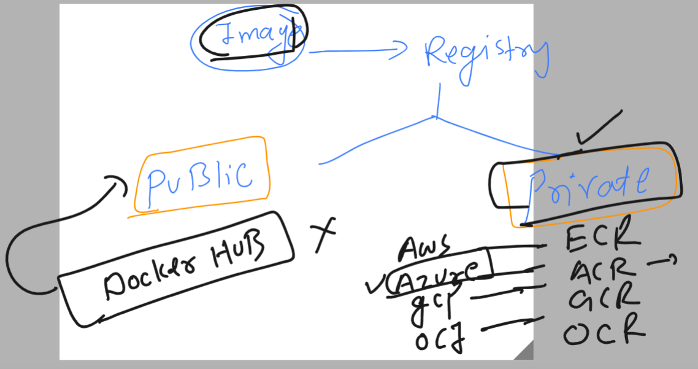

# k8s-cloud4c-b2

### testing lab env connection 

```
[ec2-user@docker ashu-docker-images]$ kubectl  config get-contexts 
CURRENT   NAME                          CLUSTER      AUTHINFO           NAMESPACE
*         kubernetes-admin@kubernetes   kubernetes   kubernetes-admin   ashu-space
[ec2-user@docker ashu-docker-images]$ 
[ec2-user@docker ashu-docker-images]$ 
[ec2-user@docker ashu-docker-images]$ kubectl  get  pods
No resources found in ashu-space namespace.
[ec2-user@docker ashu-docker-images]$ kubectl  get  svc
```

### Exploring RC again by Understanding 


### YAML of RC 

```
apiVersion: v1 
kind: ReplicationController 
metadata:
  name: ashu-app-rc # name of replication controller 
spec: 
  replicas: 1 # number of pods we want to be created 
  template: # for giving pod template information 
    metadata:
      labels: # label of pod which will be used by service to find 
        x: helloashu # key & value  x and helloashu 
    spec:
      containers:
      - image: dockerashu/ashuwebsite:v1
        name: ashuc1
        ports:
        - containerPort: 80 

```

### lets create it 

```
ec2-user@docker ashu-docker-images]$ ls
ashu-k8s-appdeploy  html-sample-app  java-code  python-code  webapps
[ec2-user@docker ashu-docker-images]$ cd  ashu-k8s-appdeploy/
[ec2-user@docker ashu-k8s-appdeploy]$ ls
ashu-pod1.yaml   ashu-webapp-rc.yaml  day7nodeport.yaml  mypod.yaml     taskday7.yaml
ashupodnew.json  autopod.yaml         day7pod.yaml       nodeport.yaml
[ec2-user@docker ashu-k8s-appdeploy]$ kubectl  create  -f  ashu-webapp-rc.yaml 
replicationcontroller/ashu-app-rc created
[ec2-user@docker ashu-k8s-appdeploy]$ kubectl   get   rc 
NAME          DESIRED   CURRENT   READY   AGE
ashu-app-rc   1         1         1       4s
[ec2-user@docker ashu-k8s-appdeploy]$ kubectl   get  pods 
NAME                READY   STATUS    RESTARTS   AGE
ashu-app-rc-wmr7w   1/1     Running   0          8s
[ec2-user@docker ashu-k8s-appdeploy]$ 

```

### Creating service by exposing RC 

```
ec2-user@docker ashu-k8s-appdeploy]$ kubectl   get  rc 
NAME          DESIRED   CURRENT   READY   AGE
ashu-app-rc   1         1         1       8m10s
[ec2-user@docker ashu-k8s-appdeploy]$ 
[ec2-user@docker ashu-k8s-appdeploy]$ kubectl   expose  rc  ashu-app-rc  --type  NodePort --port 80 --name ashulb2 --dry-run=client -o yaml   >svcbyrc.yaml 
[ec2-user@docker ashu-k8s-appdeploy]$ kubectl create -f  svcbyrc.yaml 
service/ashulb2 created
[ec2-user@docker ashu-k8s-appdeploy]$ kubectl  get  svc
NAME      TYPE       CLUSTER-IP       EXTERNAL-IP   PORT(S)        AGE
ashulb2   NodePort   10.100.179.242   <none>        80:31537/TCP   5s
[ec2-user@docker ashu-k8s-appdeploy]$ 
[ec2-user@docker ashu-k8s-appdeploy]$ 
```

### Expose is automatically matching label of pod with selector or service 

```
ec2-user@docker ashu-k8s-appdeploy]$ kubectl  get  pods --show-labels 
NAME                READY   STATUS    RESTARTS   AGE     LABELS
ashu-app-rc-wmr7w   1/1     Running   0          9m53s   x=helloashu
[ec2-user@docker ashu-k8s-appdeploy]$ 
[ec2-user@docker ashu-k8s-appdeploy]$ kubectl  get  svc -o wide 
NAME      TYPE       CLUSTER-IP       EXTERNAL-IP   PORT(S)        AGE   SELECTOR
ashulb2   NodePort   10.100.179.242   <none>        80:31537/TCP   69s   x=helloashu
[ec2-user@docker ashu-k8s-appdeploy]$ 


```

## testing power of RC 

### Recreation 

```
ec2-user@docker ashu-k8s-appdeploy]$ kubectl   get  nodes
NAME                            STATUS   ROLES           AGE   VERSION
ip-172-31-18-85.ec2.internal    Ready    <none>          11d   v1.26.5
ip-172-31-23-211.ec2.internal   Ready    control-plane   11d   v1.26.5
ip-172-31-23-254.ec2.internal   Ready    <none>          11d   v1.26.5
ip-172-31-27-200.ec2.internal   Ready    <none>          11d   v1.26.5
ip-172-31-29-164.ec2.internal   Ready    <none>          11d   v1.26.5
[ec2-user@docker ashu-k8s-appdeploy]$ 
[ec2-user@docker ashu-k8s-appdeploy]$ kubectl   get  po -o wide 
NAME                READY   STATUS    RESTARTS   AGE   IP               NODE                            NOMINATED NODE   READINESS GATES
ashu-app-rc-wmr7w   1/1     Running   0          19m   192.168.161.30   ip-172-31-23-254.ec2.internal   <none>           <none>
[ec2-user@docker ashu-k8s-appdeploy]$ kubectl delete pod  ashu-app-rc-wmr7w 
pod "ashu-app-rc-wmr7w" deleted
[ec2-user@docker ashu-k8s-appdeploy]$ kubectl   get  po -o wide 
NAME                READY   STATUS    RESTARTS   AGE   IP               NODE                            NOMINATED NODE   READINESS GATES
ashu-app-rc-wczbq   1/1     Running   0          5s    192.168.161.32   ip-172-31-23-254.ec2.internal   <none>           <none>
[ec2-user@docker ashu-k8s-appdeploy]$ 


```

### scaling 

```
ec2-user@docker ashu-k8s-appdeploy]$ kubectl  scale  rc  ashu-app-rc  --replicas 3
replicationcontroller/ashu-app-rc scaled
[ec2-user@docker ashu-k8s-appdeploy]$ kubectl  get  rc 
NAME          DESIRED   CURRENT   READY   AGE
ashu-app-rc   3         3         3       23m
[ec2-user@docker ashu-k8s-appdeploy]$ 
[ec2-user@docker ashu-k8s-appdeploy]$ kubectl  get  pods -o wide
NAME                READY   STATUS    RESTARTS   AGE     IP                NODE                            NOMINATED NODE   READINESS GATES
ashu-app-rc-hh7q4   1/1     Running   0          10s     192.168.255.93    ip-172-31-18-85.ec2.internal    <none>           <none>
ashu-app-rc-rb8cn   1/1     Running   0          10s     192.168.151.164   ip-172-31-29-164.ec2.internal   <none>           <none>
ashu-app-rc-wczbq   1/1     Running   0          3m38s   192.168.161.32    ip-172-31-23-254.ec2.internal   <none>           <none>
[ec2-user@docker ashu-k8s-appdeploy]$ 

```

### service is storing pod ip:port details in endpoint database 

```
ec2-user@docker ashu-k8s-appdeploy]$ kubectl  get  svc -o wide 
NAME      TYPE       CLUSTER-IP       EXTERNAL-IP   PORT(S)        AGE   SELECTOR
ashulb2   NodePort   10.100.179.242   <none>        80:31537/TCP   16m   x=helloashu
[ec2-user@docker ashu-k8s-appdeploy]$ 
[ec2-user@docker ashu-k8s-appdeploy]$ 
[ec2-user@docker ashu-k8s-appdeploy]$ kubectl  get  endpoints
NAME      ENDPOINTS                                                AGE
ashulb2   192.168.151.164:80,192.168.161.32:80,192.168.255.93:80   16m
[ec2-user@docker ashu-k8s-appdeploy]$ 
[ec2-user@docker ashu-k8s-appdeploy]$ kubectl  scale  rc  ashu-app-rc  --replicas 1
replicationcontroller/ashu-app-rc scaled
[ec2-user@docker ashu-k8s-appdeploy]$ kubectl  get  endpoints
NAME      ENDPOINTS           AGE
ashulb2   192.168.161.32:80   17m
[ec2-user@docker ashu-k8s-appdeploy]$ 
```

### Understanding private image registry and cloud option in registry as well



### pushing image to azure cloud private registry 

```
[ec2-user@docker ashu-k8s-appdeploy]$ docker  tag  ashuwebapp:v1   ashutoshh.azurecr.io/ashutoshh/ashuwebui:v1 
[ec2-user@docker ashu-k8s-appdeploy]$ 
[ec2-user@docker ashu-k8s-appdeploy]$ docker  login  ashutoshh.azurecr.io  
Username: ashutoshh
Password: 
WARNING! Your password will be stored unencrypted in /home/ec2-user/.docker/config.json.
Configure a credential helper to remove this warning. See
https://docs.docker.com/engine/reference/commandline/login/#credentials-store

Login Succeeded
```

### pushing it

```
[ec2-user@docker ashu-k8s-appdeploy]$ docker  push   ashutoshh.azurecr.io/ashutoshh/ashuwebui:v1
The push refers to repository [ashutoshh.azurecr.io/ashutoshh/ashuwebui]
06c6edc3cac2: Pushed 
4d33db9fdf22: Pushed 
6791458b3942: Pushed 
2731b5cfb616: Pushed 
043198f57be0: Pushed 
5dd6bfd241b4: Pushed 
8cbe4b54fa88: Pushed 
v1: digest: sha256:844e7692244c84fa3aa0e8c6acb0e5689b7affbf8640b944c02041743c4d4311 size: 1781
[ec2-user@docker ashu-k8s-appdeploy]$ docker logout ashutoshh.azurecr.io
Removing login credentials for ashutoshh.azurecr.io
[ec2-user@docker ashu-k8s-appdeploy]$ 
```


