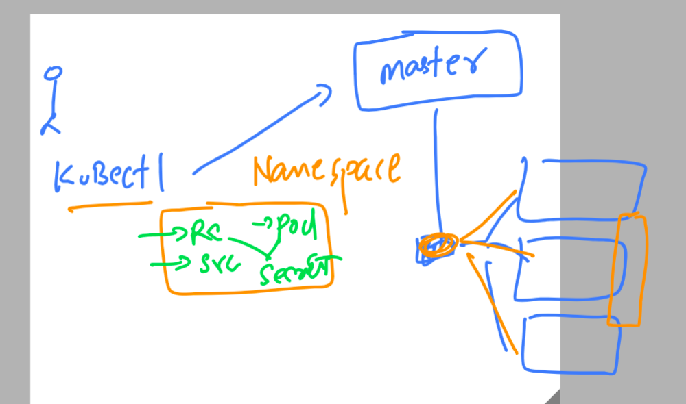
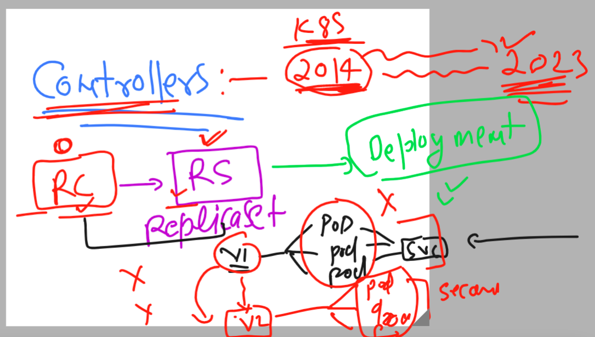
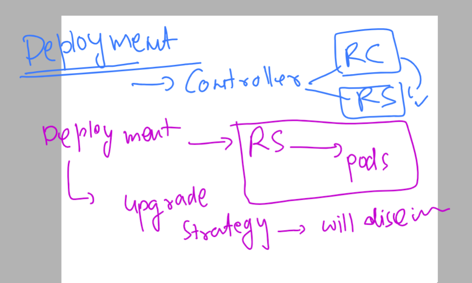

# k8s-cloud4c-b2

## Revision 



### cleaning up namespace data

```
[ec2-user@docker ashu-docker-images]$ kubectl  config  get-contexts 
CURRENT   NAME                          CLUSTER      AUTHINFO           NAMESPACE
*         kubernetes-admin@kubernetes   kubernetes   kubernetes-admin   ashu-space
[ec2-user@docker ashu-docker-images]$ 
[ec2-user@docker ashu-docker-images]$ kubectl  get  all
NAME              READY   STATUS    RESTARTS      AGE
pod/ashu-newpod   1/1     Running   1 (10m ago)   22h
[ec2-user@docker ashu-docker-images]$ kubectl  delete all --all
pod "ashu-newpod" deleted
[ec2-user@docker ashu-docker-images]$ 
```

### New controller Deployment is ultimate choice of k8s engg to deploy and upgrade app



### More info about Deployment controller 



### Creating deployment controller 

```
 kubectl  create deployment ashu-deploy --image=dockerashu/ashuwebsite:v1  --port 80 --dry-run=client -o yaml >deployment1.yaml 
[ec2-user@docker ashu-k8s-appdeploy]$ 
```
### deployment of deploy

```
[ec2-user@docker ashu-k8s-appdeploy]$ kubectl create  -f  deployment1.yaml 
deployment.apps/ashu-deploy created
[ec2-user@docker ashu-k8s-appdeploy]$ kubectl  get  deployment 
NAME          READY   UP-TO-DATE   AVAILABLE   AGE
ashu-deploy   1/1     1            1           11s
[ec2-user@docker ashu-k8s-appdeploy]$ kubectl  get  rs
NAME                     DESIRED   CURRENT   READY   AGE
ashu-deploy-85b7b44d4b   1         1         1       14s
[ec2-user@docker ashu-k8s-appdeploy]$ kubectl   get  pods
NAME                           READY   STATUS    RESTARTS   AGE
ashu-deploy-85b7b44d4b-wzxqk   1/1     Running   0          18s
[ec2-user@docker ashu-k8s-appdeploy]$ 
```
### scaling of deploy to pod 

```
[ec2-user@docker ashu-k8s-appdeploy]$ kubectl  get  deploy 
NAME          READY   UP-TO-DATE   AVAILABLE   AGE
ashu-deploy   1/1     1            1           2m51s
[ec2-user@docker ashu-k8s-appdeploy]$ kubectl  get po -o wide
NAME                           READY   STATUS    RESTARTS   AGE     IP               NODE                            NOMINATED NODE   READINESS GATES
ashu-deploy-85b7b44d4b-wzxqk   1/1     Running   0          2m56s   192.168.161.48   ip-172-31-23-254.ec2.internal   <none>           <none>
[ec2-user@docker ashu-k8s-appdeploy]$ kubectl scale deployment ashu-deploy --replicas 3
deployment.apps/ashu-deploy scaled
[ec2-user@docker ashu-k8s-appdeploy]$ kubectl  get po -o wide
NAME                           READY   STATUS    RESTARTS   AGE     IP                NODE                            NOMINATED NODE   READINESS GATES
ashu-deploy-85b7b44d4b-97t8p   1/1     Running   0          2s      192.168.109.103   ip-172-31-27-200.ec2.internal   <none>           <none>
ashu-deploy-85b7b44d4b-nqzw8   1/1     Running   0          2s      192.168.151.183   ip-172-31-29-164.ec2.internal   <none>           <none>
ashu-deploy-85b7b44d4b-wzxqk   1/1     Running   0          3m10s   192.168.161.48    ip-172-31-23-254.ec2.internal   <none>           <none>
[ec2-user@docker ashu-k8s-appdeploy]$ 
```

### creating svc 

```
[ec2-user@docker ashu-k8s-appdeploy]$ kubectl  get deploy
NAME          READY   UP-TO-DATE   AVAILABLE   AGE
ashu-deploy   3/3     3            3           5m25s
[ec2-user@docker ashu-k8s-appdeploy]$ kubectl  get rs
NAME                     DESIRED   CURRENT   READY   AGE
ashu-deploy-85b7b44d4b   3         3         3       5m28s
[ec2-user@docker ashu-k8s-appdeploy]$ 
[ec2-user@docker ashu-k8s-appdeploy]$ 
[ec2-user@docker ashu-k8s-appdeploy]$ kubectl  get  po
NAME                           READY   STATUS    RESTARTS   AGE
ashu-deploy-85b7b44d4b-97t8p   1/1     Running   0          2m24s
ashu-deploy-85b7b44d4b-nqzw8   1/1     Running   0          2m24s
ashu-deploy-85b7b44d4b-wzxqk   1/1     Running   0          5m32s
[ec2-user@docker ashu-k8s-appdeploy]$ kubectl  expose deployment ashu-deploy --type NodePort --port 80 --name ashulb4 --dry-run=client -o yaml >nodeport4.yaml 
[ec2-user@docker ashu-k8s-appdeploy]$ kubectl create -f nodeport4.yaml 
service/ashulb4 created
[ec2-user@docker ashu-k8s-appdeploy]$ kubectl  get svc
NAME      TYPE       CLUSTER-IP     EXTERNAL-IP   PORT(S)        AGE
ashulb4   NodePort   10.107.60.19   <none>        80:31284/TCP   4s
[ec2-user@docker ashu-k8s-appdeploy]$ kubectl  get  ep 
NAME      ENDPOINTS                                                 AGE
ashulb4   192.168.109.103:80,192.168.151.183:80,192.168.161.48:80   8s
```


